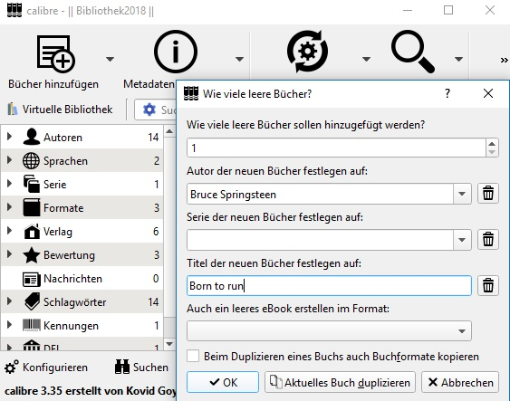
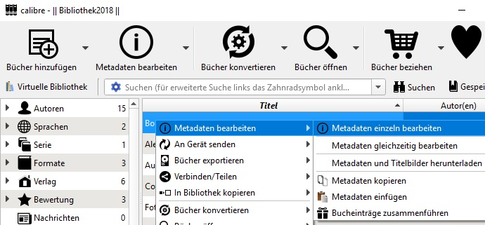
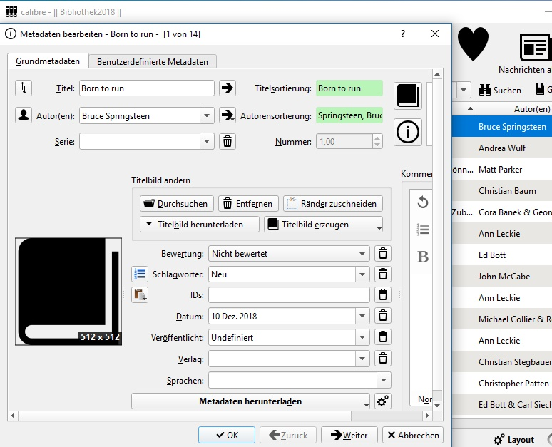
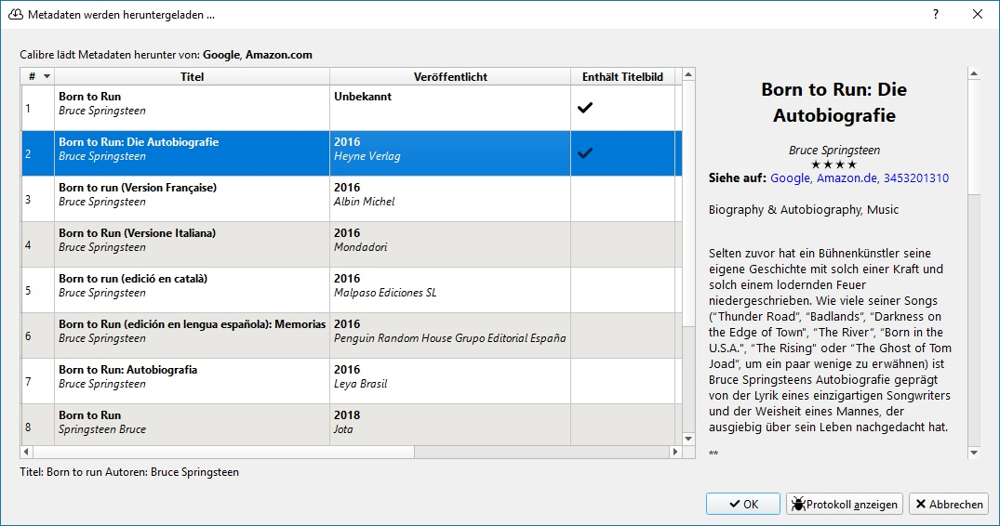
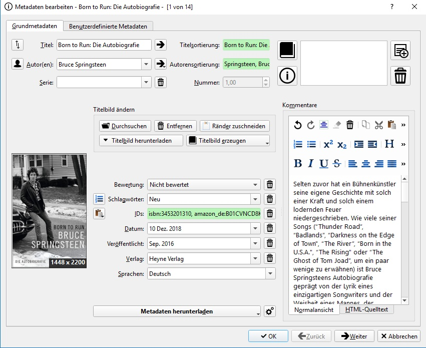
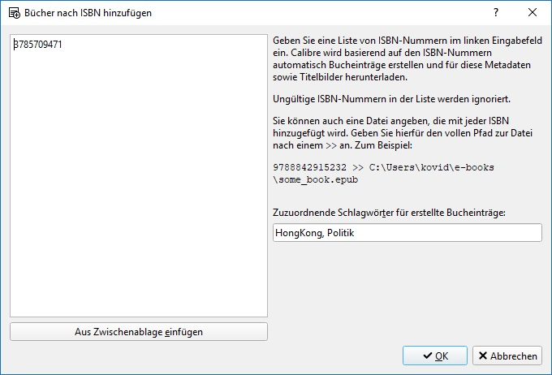
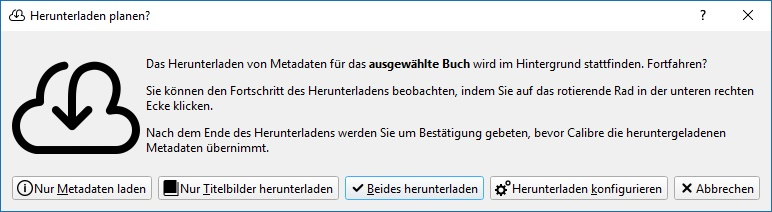
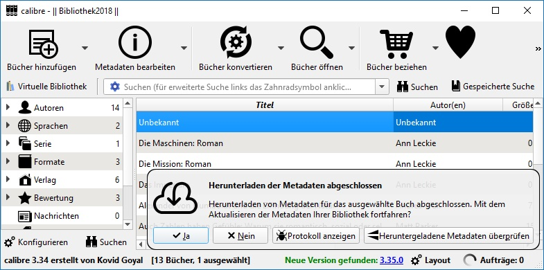

# Wie ich mit Calibre meine EBooks und mehr organisiere

Calibre hat ein Alleinstellungsmermal, wenn es um die Vewaltung (elektronischer) Bücher geht. Es geht also nicht um Programme, die man für die [Literaturverwaltung](http://mediatum.ub.tum.de/doc/1316333/1316333.pdf) in der Wissenschaft einsetzt. Und es geht auch nicht um Dokumenten-Managementsysteme. Die Übergänge sind je nach Programm fliessend bzw. unscharf.  Calibre wird für Windows, Linux, MacOS und als "Portable Version" angeboten.

## Meta

Erstellt:		31. Oktober 2018  
Modifiziert:	21. Dezember 2018  

## Calibre in der Praxis

Zu der Software Calibre gibt es genügend Einsteiger Tutorials bzw. Videos. Dieser Artikel reflektiert meine Vorgehensweise, wie ich mit Calibre arbeite.  
Ich lege mir eine Textdatei als Log Datei an, worin ich fortlaufend meine Entscheidungen wie ich einen bestimmten Sachverhalt handhabe protokolliere. Die Summe dieser Entscheide ergeben nacher das Einsatzkonzept. Parallel dazu entsteht die FAQ ("Frequent ask Question"), wo ich wichtige Punkte zusammenfasse. Z.B. ersetze ich das deusche scharfe S ("ẞ") mit zwei "ss".

### Gelesen

Die Spalten sind Eigenschaften ("Attribute") eines Buches. "Gelesen" ist nicht dabei, daher erstelle ich als Erstes dafür eine Spalte (Typ "boolean" (J/N)). Regelmässig überprüfe ich, welche Bücher in der Spalte "Gelesen" noch keinen grünen Haken haben. Entweder ich lese sie asap oder lösche sie wieder, weil einfach die Zeit / Fokus dafür fehlt.  
Ausnahmen sind Nachschlagewerke, Lehrbücher und vereinzelte Sachbücher. Bei Sachbücher spielt der Gedanke hinein, dass die Bücher nur wenig Speicherplatz beanspruchen.

### Dateitypen

[Calibre](https://manual.calibre-ebook.com/de/faq.html) kann diverse Dateiformate anzeigen und konvertiern. Ich arbeite mit diesen Formaten:  
* EPUB
* PDF
* CBR / CBZ
* TXT

CBR / CBZ verwende ich für Bilderbücher ("Comic"). TXT behalte ich auf Grund der universellen Lesbarkeit bei. EPUB ist das verbreiteste Dateiformat. Es wird so gut wie auf allen Geräten und Betriebssytemen verwendet. PDF verwende ich vor allem für Fachbücher. Diese verwende ich in der Regel auch auf grösseren Bildschirmen. 

### Sprachen
Das Feld Sprache kann 3 Werte haben:
* DE (Deutsch)
* EN (Englisch)
* CN (Cantonesisch, Chinesisch tradionell, Chinesisch modern)

Zweisprachige Bücher werden mit einer - i.d.R. der erst genannten - gekennzeichnet. Das Feld erlaubt Mehrfachwerte. Jedoch ist das für die Suche nicht effizient. Andere Sprachen (FR / IT / SP) kommen nur vor, wenn in der Sammlung Lehrbücher zu dieser Sprache hinzugefügt werden.

### Ansicht einstellen
Da Calibre weit mehr als ein "Reader" ist, ist die Frage nach der optimalen Ansicht nicht so einfach zu beantworten. Auf meinen Geräten mit Android verwende ich als Reader die App "[Moon Reader](https://play.google.com/store/apps/details?id=com.flyersoft.moonreader&hl=en)". Diese App simuliert ein Bücherbrett, damit Assoziaton zu Büchern in der realen Welt gegeben ist. Bücher Leser sind ja nicht nur am reinen lesen interessiert, sondern es geht auch um das schmöckern im Büchergestell.  

### Visuell
Wenn man in Calibre die Ansicht "Titelbildraster wählt, "Schlagwortbrowser" und "Über dieses Buch" deaktiviert, sieht man nur das Bild des Buches. Optisch spannender ist die Ansicht "Titelbildbrowser". In dieser Ansicht werden die Titelbilder zentral angezeigt und mit einem Mausklick wird der nächste Buchtitel angezeigt.  Der Mausklick kann mit einem Windows Tool wie [MouseMover](http://murb.com/index.php?page_id=235) automatisiert werden. So kann man einen netten Abend mit (Bücher-) Freunden um ein hübsches Detail erweitert werden. Erst Recht, wenn mit dem Handy oder Tablet direkt auf das Buch und die Metainformationen zugegriffen werden kann. Dank der Serverfunktion von Calibre, kann man jedeM Gerät im LAN (auch über das Internet) den Zugriff auf Calibre ermöglichen.

### Suchen
Meine Nutzung der Bücher in Calibre ist mehrheitlich eine Recherche. D.h. ich suche E-Books zu einem Thema oder einem Autor. Daher ist diese Variante des Zugriffs auf die Bücher im  Zentrum. Einerseits hat es ein Textfeld mit dem Begriffe in allen Metadaten gesucht werden können. Auch gezielt Suchbegriffe in bestimmten Kategorien wie "Titel" oder "Author. Dazu wird auch eine grafische Suchmaske angeboten. Andererseits kann man einen Schlagwort Katalog in Form von Kategorien aufbauen. 

### Nicht digitale Elemente verwalten

Gedrucktes wie Bücher oder Zeitschriften können auch mit Calibre verwaltet werden. Auch hier geht es nicht um eine bibliografische Qualität in der Verwaltung, sondern eine einfache und effiziente Lösung. Im Menupunkt "Bücher hinzufügen" hat es zwei in Frage kommende Untermenupunkte:
* "Leeres Buch hinzufügen"
* "Von ISBN hinzufügen"

Der Vorgang ist weitgehend identisch mit dem hinzufügen eines digitalen Buches (Epub, PDF, etc.). Eine Bilderstrecke verdeutlicht die einzelnen Schritte. In diesem Beispiel ziehe ich das Buch "Born to Run" von "Bruce Springsteen" heran.

### "Leeres Buch hinzufügen"

*  
*  
*  
*  
*  

### "Von ISBN hinzufügen"

*  
*  
*  

## Quellen

- [Calibre Website](https://calibre-ebook.com/download_windows)  
- [Calibre Handbuch](https://manual.calibre-ebook.com/de/)
- [Calibre Videos (en)](https://calibre-ebook.com/demo)
- [Forum (DE)](https://www.e-reader-forum.de/e-book-formate-software/board60-calibre/?s=39eaa785ba813e62718c389972f641e287722c48)  
- [DRM und eBooks](https://www.ebooknet.de/know-how/drm-und-ebooks)  
- [e-teaching.org: ePub](https://www.e-teaching.org/technik/aufbereitung/text/e_pub)
- [wikipedia.de: pdf](https://de.wikipedia.org/wiki/Portable_Document_Format)
