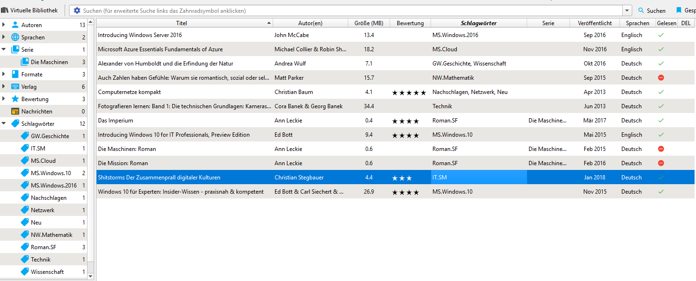

# Wie ich mit Calibre meine EBooks und mehr organisiere

Calibre hat ein Alleinstellungsmermal, wenn es um die Vewaltung (elektronischer) Bücher geht. Es geht also nicht um Programme, die man für die [Literaturverwaltung](http://mediatum.ub.tum.de/doc/1316333/1316333.pdf) in der Wissenschaft einsetzt. Und es geht auch nicht um Dokumenten-Managementsysteme. Die Übergänge sind je nach Programm fliessend bzw. unscharf.  Calibre wird für Windows, Linux, MacOS und als "Portable Version" angeboten.

# Calibre in der Praxis

Zu der Software Calibre gibt es genügend Einsteiger Tutorials bzw. Videos. Dieser Artikel reflektiert meine Vorgehensweise, wie ich mit Calibre arbeite.  
Ich lege mir eine Textdatei als Log Datei an, worin ich fortlaufend meine Entscheidungen wie ich einen bestimmten Sachverhalt handhabe protokolliere. Die Summe dieser Entscheide ergeben nacher das Einsatzkonzept. Parallel dazu entsteht die FAQ ("Frequent ask Question"), wo ich wichtige Punkte zusammenfasse. Z.B. ersetze ich das deusche scharfe S ("ẞ") mit zwei "ss".

## Angezeite Felder

Die Oberfläche von Calibre sieht nach meiner Grundkonfiguration so aus:  

  
In der Statuszeile kann über den Menupunkt Layout ("Zahnrad") die Ansicht angepasst werden. Der Hinweis "Neue Version gefunden..."  wird angezeigt, wenn Updates nicht automatisch instaliert werden. Details zu den Feldern folgen weiter unten.

### Titel

Das Feld Titel beinhaltet den Titel und den Untertitel des Buches. Auf dem Buchtitel steht oft nur der Hauptitel (KISS Prinzip). 

### Autor

Mehrere Autoren im Feld Autor werden durch "&" angegeben.

### Bewertung

Meine persönliche Bewertung des Buches.

### Schlagwörter

Eine Regel im Hintergrund setzt für jedes neue Buch das Schlagwort "Neu". Wie sehe ich über den Wert dieser Spalte, welche Bücher noch nicht bearbeitet sind. Vergleichbar mit Musikdateien und den Tags differenziere ich nur soweit wie es mir dient. Mehrere Schlagworte werden mit einem Komma getrennt. Beispiel: "Alexander von Humboldt und die Erfindung der Natur". Dafür setze ich die Schlagwörter "GW.Geschichte, Wissenschaft".  
Schlagwörter können hierarchisch aufgebaut sein. In diesem Beispiel ist das Schlagwort "Geschichte", ein Unterschlagwort von "GW" ("Geisteswissenschaft"). Neue Stichwort inklusive Hierarchie können direkt in der Eingabe des Feldes erstellt werden. D.h. mit der Eingabe dieser Schlagwörter erstellt man drei Schlagwörter, wobei für das Buch nur zwei gesetzt sind. Ob das Stichwort "Geschichte" einem übergeordnetem Schlagwort untergeordnet ist, ist  keine Aussage zum Buch.  

### Serie

Für Serie gelten die Aussagen im Abschnitt "Schlagwörter". Eine Serie besteht auf dem Namen der Serie sowie in eckigen Klammern eine Zahl. In dieser Grafik sieht man als Beispiel die Serie "Die Maschinen" von "Ann Leckie". Eine Serie ohne Zahl kann nicht erstellt werden. Wenn aus einem mir nicht vorstellbaren Grund das bezweckt wird, gibt man in den eckigen Klammern jedesmal die gleiche Zahl ein. Z.B. 0 ("Null"), da diese Ziffer ja keine Aussage über dieses Buch und den Platz in der Reihe ist.  

Eine interessante Frage ist, was bestimmt die Reihenfolge. Die Veröffentlichung oder die inhaltliche Chronologie. Ich richte mich nach der inhaltlichen Chronologie.

### Verlag

Das Feld verlag blende ich aus. Ich achte auch darauf, dass für ein Verlag bzw. Verlagsgruppe nur ein Begriff gesetzt ist.

## Neue Felder

Die Spalten sind Eigenschaften ("Attribute") eines Buches. Calibre ist sehr flexibel und lässt sich gerade über neue Felder für viele Zwecke anpassen.

### Gelesen

"Gelesen" ist nicht dabei, daher erstelle ich als Erstes dafür eine Spalte (Typ "boolean" (J/N)). Regelmässig überprüfe ich, welche Bücher in der Spalte "Gelesen" noch keinen grünen Haken haben. Entweder ich lese sie asap oder lösche sie wieder, weil einfach die Zeit / Fokus dafür fehlt.  
Ausnahmen sind Nachschlagewerke, Lehrbücher und vereinzelte Sachbücher. Bei Sachbücher spielt der Gedanke hinein, dass die Bücher nur wenig Speicherplatz beanspruchen.

### DEL

Bücher die ich in Calibre nicht mehr aktiv habe. Da der Speicherplatzbedarf von digitalen Dokumenten gering ist, werden sie nur von Zeit zu Zeit gelöscht.  

## Dateitypen

[Calibre](https://manual.calibre-ebook.com/de/faq.html) kann diverse Dateiformate anzeigen und konvertiern. Ich arbeite mit diesen Formaten:  
* EPUB
* PDF
* CBR / CBZ
* TXT

CBR / CBZ verwende ich für Bilderbücher ("Comic"). TXT behalte ich auf Grund der universellen Lesbarkeit bei. EPUB ist das verbreiteste Dateiformat. Es wird so gut wie auf allen Geräten und Betriebssytemen verwendet. PDF verwende ich vor allem für Fachbücher. Diese verwende ich in der Regel auch auf grösseren Bildschirmen. Calibre behersch das konvertieren von vielen Formaten.

## Sprachen
Das Feld Sprache kann 3 Werte haben:
* DE (Deutsch)
* EN (Englisch)
* CN (Cantonesisch, Chinesisch tradionell, Chinesisch modern)

Zweisprachige Bücher werden mit einer - i.d.R. der erst genannten - gekennzeichnet. Das Feld erlaubt Mehrfachwerte. Jedoch ist das für die Suche nicht effizient. Andere Sprachen (FR / IT / SP) kommen nur vor, wenn in der Sammlung Lehrbücher zu dieser Sprache hinzugefügt werden.

## Ansicht einstellen
Da Calibre weit mehr als ein "Reader" ist, ist die Frage nach der optimalen Ansicht nicht so einfach zu beantworten. Auf meinen Geräten mit Android verwende ich als Reader die App "[Moon Reader](https://play.google.com/store/apps/details?id=com.flyersoft.moonreader&hl=en)". Diese App simuliert ein Bücherbrett, damit Assoziaton zu Büchern in der realen Welt gegeben ist. Bücher Leser sind ja nicht nur am reinen lesen interessiert, sondern es geht auch um das schmöckern im Büchergestell.  

### Visuell
Wenn man in Calibre die Ansicht "Titelbildraster wählt, "Schlagwortbrowser" und "Über dieses Buch" deaktiviert, sieht man nur das Bild des Buches. Optisch spannender ist die Ansicht "Titelbildbrowser". In dieser Ansicht werden die Titelbilder zentral angezeigt und mit einem Mausklick wird der nächste Buchtitel angezeigt.  Der Mausklick kann mit einem Windows Tool wie [MouseMover](http://murb.com/index.php?page_id=235) automatisiert werden. So kann man einen netten Abend mit (Bücher-) Freunden um ein hübsches Detail erweitert werden. Erst Recht, wenn mit dem Handy oder Tablet direkt auf das Buch und die Metainformationen zugegriffen werden kann. Dank der Serverfunktion von Calibre, kann man jedeM Gerät im LAN (auch über das Internet) den Zugriff auf Calibre ermöglichen.

### Suchen
Meine Nutzung der Bücher in Calibre ist mehrheitlich eine Recherche. D.h. ich suche E-Books zu einem Thema oder einem Autor. Daher ist diese Variante des Zugriffs auf die Bücher im  Zentrum. Einerseits hat es ein Textfeld mit dem Begriffe in allen Metadaten gesucht werden können. Auch gezielt Suchbegriffe in bestimmten Kategorien wie "Titel" oder "Author. Dazu wird auch eine grafische Suchmaske angeboten. Andererseits kann man einen Schlagwort Katalog in Form von Kategorien aufbauen. 

# Quellen

[Calibre Website](https://calibre-ebook.com/download_windows)  

[Forum (DE)](https://www.e-reader-forum.de/e-book-formate-software/board60-calibre/?s=39eaa785ba813e62718c389972f641e287722c48)  

[DRM und eBooks](https://www.ebooknet.de/know-how/drm-und-ebooks)  

[e-teaching.org: ePub](https://www.e-teaching.org/technik/aufbereitung/text/e_pub)

[wikipedia.de: pdf](https://de.wikipedia.org/wiki/Portable_Document_Format)
