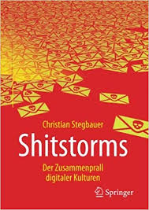

Meine Logdatei mit Notizen und Stichworten zu den gelesenen Büchern.  Die Software Calibre ist die Software mit der ich die Bücher (Digital und Papier) verwalte. D.h. zu jedem Buch den Vermerk gelesen mit Datum, Stichworten, Teil einer Serie, etc.  

Trotz wiederholter Anfrage bietet kein schweizer Buchhändler eine Wunschliste für die Kunden an. Daher hier der Verweis auf meine Amazon [Wunschliste](https://www.amazon.de/gp/registry/wishlist?ref=nav_wishlist_btn)  

# November 2018  

## Alexander v. Humboldt und die Erfindung der Natur

  

| Titel:    | Alexander v. Humboldt und die Erfindung der Natur | 
| Autor:    | Andrea Wulf   | 
| Verlag:   | Bertelsmann Verlag   | 
| ISBN:     | 978-3-570-10206-0   | 

Spannende und historische Geschichte über das Leben Alexander von Humboldt. Kapitel 9 hat mir besonders gefallen. Nach fünfjähriger Reise mit dutzenden von Truhen voller wissenschaftlicher Fundstücke trifft er in Paris ein. Paris war zu der Zeit das Mekka der Wissenschaft, da dank der Revolution die Herrschaft der Religion überwunden war. Zugleich wird beschrieben wie sehr sich Paris in fünf Jahren geändert hat, da Napoleon als Diktator die Architektur und das politische Klima radikal verändert hat. 

## Shitstorms Der Zusammenprall digitaler Kulturen

  

| Titel:    | Shitstorms Der Zusammenprall digitaler Kulturen | 
| Autor:    | Christian Stegbauer   | 
| Verlag:   | Springer Verlag   | 
| ISBN:     | 978-3-658-19955-5   | 

Was früher der Saubannerzug war, ist in der digitalen Welt der Shitstorm. In der postfaktischen Welt sind Emotionen und nicht Fakten bzw. Logik die Grundlage der Entscheidung. Wie das ein Professor aus Sicht seiner akademischen Welt das interpretiert, dass will ich wissen.  

Erpressern gibt man nicht nach, sonst öffnet man weiteren Erpressungen Tür und Tor. Das ist Konsens in aller Welt. Shitstorm ist dasselbe. Man kann wie die Swisscom einknicken, wenn sich ein Bestsellerautor wegen wiederholter Probleme in seiner Hausinstallation meldet und ihn hofieren, in dem man ihm sogar in seiner Landesprache zurück schreibt und sofort einen Techniker schickt. Brian Krebs ein anerkannter Security Forscher schrieb diesen Artikel "https://krebsonsecurity.com/2018/03/who-and-what-is-coinhive/". Da er das von Gruppen aus dem linken Spektrum verwendete Doxing (nennen der Namen und Adressen der Verantwortlichen) umsetze, war einer der Hauptgründe das ein Shitstorm losbrach. Seine Reaktion war sehr professionell. Er reichte vier Tage später einen weiteren Artikel nach: https://krebsonsecurity.com/2018/03/coinhive-expose-prompts-cancer-research-fundraiser/. Brians Krebs kann mit einem Mafiajäger verglichen werden. Seine Recherche gegen die DDOS Kriminellen haben seine bei Akamai gehostete Website einer gigantischen DDOS [Attacke](https://www.zdnet.com/article/krebs-on-security-booted-off-akamai-network-after-ddos-attack-proves-pricey/) ausgesetzt unter der sogar Akamai zusammenbrach. Kurz und gut: er ist feuererprobt und hat Nerven wie Drahtseile. 

Das Buch ist eine geschichtliche und soziologische Analyse was ein Shitstorm ist. Wer sich dafür interessiert ist mit dem Buch gut bedient. Eine Erwartung hat der Autor erfüllt. Alle negativen Beispiele sind aus dem politischen Mitte-Rechts Bereich. Nicht demokratisches Verhalten von Linken Gruppen wird nie thematisiert. Ein Shitstorm bzw. das androhen - auch indirekt im Stile "Ich habe über 4000 Follower und werde das posten" - ist Gewalt. Also moralisch und rechtlich für eine offene Gesellschaft nicht akzeptabel.  

# Vor Oktober 2018

## Introducing Windows 10 for IT Professionals (Preview Edition)

  

| Titel:    | Introducing Windows 10 for IT Professionals (Preview Edition)  | 
| Autor:    | Ed Bott   | 
| Verlag:   | Microsoft Press   | 
| ISBN:     | none    | 

Eine von Ed Bott gewohnt gründliche Einführung. Basis des Buches war die Betaversion. Oft sind es Details wie das der Befehl „netsh“ zugunsten von Powershell cmdlets ausläuft, die man zu schätzen weiss.  

## Computernetze kompakt  

 

| Titel:    | Computernetze kompakt  | 
| Autor:    | Dr. Christian Baum   | 
| Verlag:   | Springer Verlag   | 
| ISBN:     | 978-3-662-57469-0    | 

Netzwerk	Christian Baun orientiert sich am OSI Modell und knapp und klar die wesentlichen Fakten durch.

Dank der konsequenten Ausrichtung auf dieses Modell verliert man den roten Faden nicht D.h. die Groborientierung ist gewährleistet.

## Als auf der Welt das Licht ausging  

 

| Titel:    | Als auf der Welt das Licht ausging  | 
| Autor:    | Tom Demarco   | 
| Verlag:   | Der Carl Hanser Verlag   | 
| ISBN:     | 978-3-446-43960-3    | 

"Der Termin" von Tom DeMarco ist wahrscheinlich der bekannteste IT und Projektmanagement Roman. Hier hat er eigentlich zwei Romane zusammen genommen. Teil 1 schildert die Entwicklung die die Wissenschaftler zwang den Stecker zu ziehen. Teil 2 ist der Aufbau der neuen Gesellschaft. Trotz Alter und amerikanischer Herkunft ist Teil  2 nichts für prüde Leser. Der 2 Teil hat auf mich schwelgerisch und konzeptlos gewirkt. Und der Abschluss des Buches passt exakt zu diesem Eindruck.

## Windows 10 für Experten  

 

| Titel:    | Windows 10 für Experten  | 
| Autor:    | Ed Bott   | 
| Verlag:   | Microsoft Press   | 
| ISBN:     | 978-3-86490-418-9    | 

Flüssig geschriebener Überflug über Windows 10 für Fortgeschrittene. Das Buch ist in Teile, diese wiederum in Kapitel aufgegliedert. Teil 4 ist für die Experten mit vielen wertvollen Informationen. Sehr zu empfehlen.  

### Leseproben:  

* [Neuerungen in Windows 10](https://www.dpunkt.de/common/leseproben//12616/2_Neuerungen%20in%20Windows%2010.pdf)
* [Schützen von Windows 10-Geräten](https://www.dpunkt.de/common/leseproben//12616/3_Sch%C3%BCtzen%20von%20Windows%2010-Ger%C3%A4ten.pdf)
* [Verwenden der Systemverwaltung](https://www.dpunkt.de/common/leseproben//12321/3_Verwenden%20der%20Systemverwaltung.pdf)
* [Automatisieren von Windows 10](https://www.dpunkt.de/common/leseproben//12321/4_Automatisieren%20von%20Windows%2010.pdf)

## Windows Server 2012 R2 - Das umfassende Handbuch

 

| Titel:    | Windows Server 2012 R2 - Das umfassende Handbuch  | 
| Autor:    | Ulrich B. Boddenberg   | 
| Verlag:   | Rheinwerk Verlag   | 
| ISBN:     | ISBN 978-3-8362-2013-2    | 

Umfassende Einführung in Windows Server 2012. Ideal für Einsteiger die sorgfältig recherchierte und sorgfältig publizierte Informationen suchen. Wird vom Verlag in der Reihe <Open Book> kostenlos online angeboten. Aber... wer einmal ein gedrucktes Buch aus dem Rheinwerk Verlag in den Fingern hatte, wird nie wieder darauf verzichten wollen. Das ist Buchdruckkunst vom Feinsten. Etwas was es im 21. Jahrhundert gar nicht mehr geben dürfte. Sehr zu empfehlen.  

