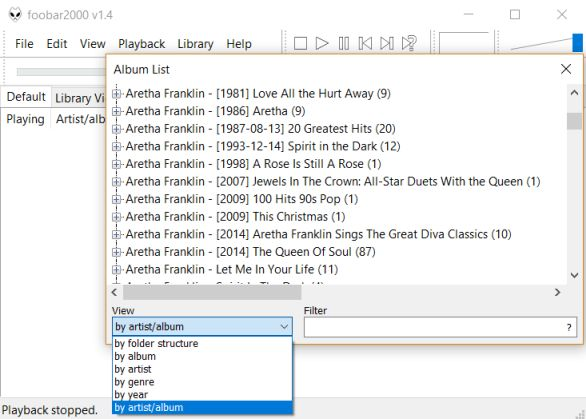
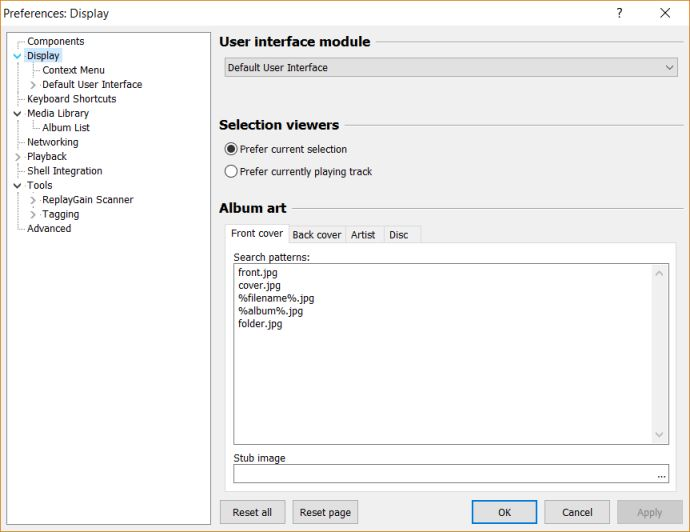
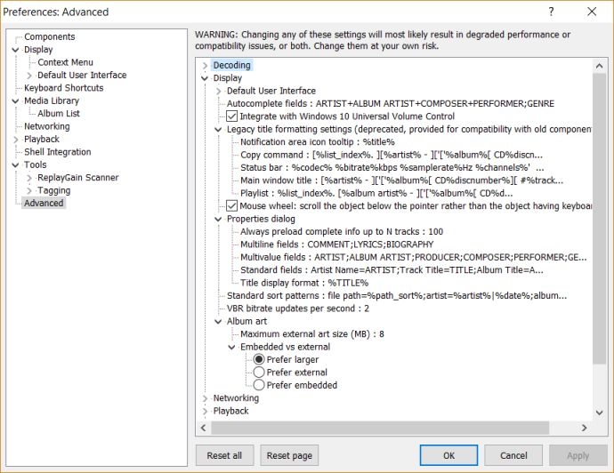
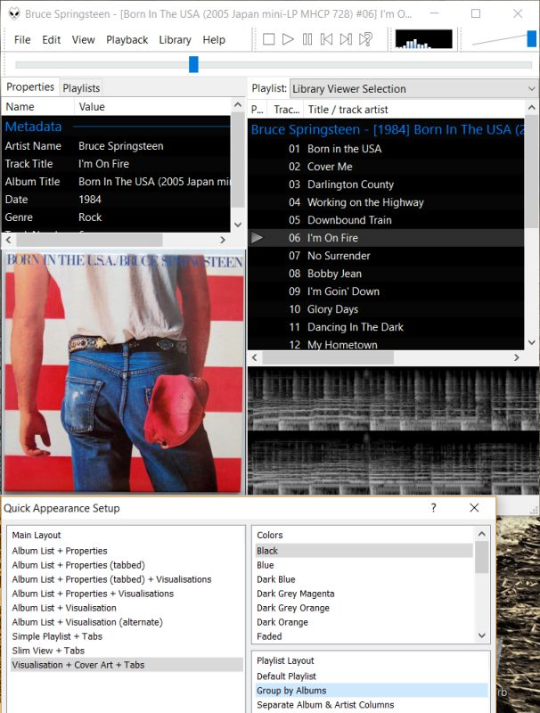

# Foobar 2000: Ein Audiotool für Windows

In der Windowswelt hat man die grösste Auswahl an Software. [Foobar2000](http://www.foobar2000.org) ist seit 2002 der Audioplayer für Nerds. Wobei Player irreführend ist, da auch CDs gerippt werden können, Tags editiert, etc. Der spartanischen Oberfläche stehen die ausgefeilten Funktionen gegenüber. Die Software kann kostenlos genutzt werden und ist "closed Source". Jedoch hat der Entwickler Peter Pawloski ein umfangreiches Entwicklerpaket unter BSD Lizenz veröffentlicht. Daher hat es eine grosse Auswahl an Zusatzsoftware (Plugins). Ein weiterer Pluspunkt ist die sehr weitgehende Konfigurationsmöglichkeiten dieses Tools. Und - last but not least - die Kommandozeile (CLI) wird unterstützt.

Wie immer ist auch dieser Post aus meiner Praxis und bezogen auf die aktuelle Version 1.4 unter Windows 10 (Build 17134.345).  

## Meta

Erstellt:		6. November 2018  
Modifiziert:	4. Januar 2019  

## Was dazu gehört und in diesem Post nicht der Platz dafür ist

Das Ziel des Postes ist es, dass Tool Foobar2000 aus meiner Praxis vorzustellen. Vorgängig sollte man die eigene Antwort auf folgende Fragen gefunden haben:  

* Dateien benennen und Ordnerstruktur wie (Nomenklatura) anlegen?  
** Wenn ein Album aus mehr als einem Datenträger besteht, die Dateien in separaten Verzeichnissen ablegen?
** Namen: Maximale Länge und welche Zeichensätze?  
** Sich an veröffentlichten Datenträgern (CD) orientieren? Wenn ja, wie mit Bootleg, Onlineveröffentlichungen, etc. umgehen?  
* Welches Dateiformat (MP3 / FLAC / ETC.)?  
* Tags: Welche Tags nutzen? Welche Informationen sollen in den Tags abgelegt werden?
* Welche Geräte / Betriebssyteme / Applikationen / Netzprotokolle sollen Zugriff auf die Musik erhalten?
* ...

## Installation  

Man hat die Wahl zwischen einer portablen    
und einer Vollinstallation für alle Windowsbenutzer. Der Unterschied ist, dass die Verknüpfung- mit Dateierweiterungen nur in der Vollinstallation erfolgt. 
Die [Installationsoptionen](http://wiki.hydrogenaud.io/index.php?title=Foobar2000:Components#Included_in_the_installer) sind i.d.R. für die allermeisten Fälle sinnvoll und beanspruchen wenig Resourcen:  

  

## Musik abspielen

Der nächste Schritt ist nun Foobar so zu konfigurieren, dass er die digitale Musik "findet". Der darauf folgende Schritt wird die Oberfläche sein, wo man viele gestalterische Freiheiten und Zusatzsoftware hat.

Mit der installierten Version von Foobar kann man wie folgt die Musikdateien laden:  
*  Datei abspielen: Rechtsklick auf die Datei (MP3 / Flac), Menupunkt "Öffnen mit" anklicken und Foobar2000 auswählen
*  Datei mit Foobar verknüpfen: Wie oben. Jedoch diesmal "Andere App auswählen" anklicken. Foobar2000 auswählen und den Haken "Immer diese..." setzen.    
*  Mit Foobar2000 direkt  
   1. Über den Menupunkt "File"   
   2. Über die Medienbibliothek (nachdem sie eingerichtet ist)  
   3- Über Shortcuts. Default ist auf [Hydrogenaudio](https://wiki.hydrogenaud.io/index.php?title=Foobar2000:Preferences:General:Keyboard_Shortcuts#Key) dokumentiert.  
   1. CLI (cmd.exe / Powershell). Doku ist auf [Hydrogenaudio](https://wiki.hydrogenaud.io/index.php?title=Foobar2000:Commandline_Guide) zu finden.  

### Musikdatenbank

Das anlegen der Musikdatenbank ist die Grundlage der effizienten Nutzung von Foobar2000. Wer einfach nur seinen Künstler oder bestimmte Alben hören will, wird ohne glücklich. Dem Sammler bzw. Geniesser der in seinen Schätzen baden will, analog Dagobert Duck in seinen Dukaten, muss eine Datenbank erstellen. Über "Library", Untermenupunkt "Configure" gelangt man auf die Konfigurationsseite.  

  

Im Abschnitt "Music folders" sind die Verzeichnisse anzugeben, die danach Foobar2000 selbständig aktualisiert. Solange in der Spalte "Pending" steht, verarbeitet Foobar2000 noch die Musiksammlung. Im Abschnitt "File types" stehen keine Einträge, da ich in der Musiksammlung nur zwei Dateitypen ("Flac" / "MP3") habe. Im Abschnitt "Library viewer selection playlist" aktiviere ich "enabled". Dadurch wird automatisch eine Playliste über alle Musikstücke in der Library erstellt. Die Konfiguration mit "OK" bestätigen.  

Über die Komponente "Album List" (Menu "Library") wird der Inhalt der Datenbank als Verzeichnisbaum dargestellt. Im Menupunkt "View" kann die Sortierung bestimmt werden. Die Struktur dieser Abfragesprache wird in diesem Artikel von [audiohq](https://www.audiohq.de/viewtopic.php?id=1089) erklärt. Alternativ kann auch der Untermenupunkt "Search" verwendet werden, um die Datenbank nach Stichworten zu durchsuchen.  

## Optik  

Die [Oberfläche](https://www.foobar2000.org/screenshots) von Foobar2000 sieht aus wie ein MS DOS Programm. In diesem Abschnitt geht es unter anderem darum, wie man diese Oberfläche ("UI = User Interface") gestalten kann. Beispiele dafür findet man hier:
* [YouTube: Demo eines Anwenders](https://www.youtube.com/watch?v=s-GOWSfX3X8)  
* [Hydrogen: Default UI Gallery](https://hydrogenaud.io/index.php?PHPSESSID=njne49qs158lkq1k8ft97b8bg1&topic=58574.475)
* [Devian Art: Foo-Nation](https://www.deviantart.com/popular-all-time/?section=&global=1&q=foobar2000&offset=0)  

Das Fundament für die Optik wird durch die gepflegte Albumsammlung mit den entsprechenden Bildern gelegt.  

### Cover  

Ein Album hat eine eigene Identität, was sich im Cover ausdrückt. Was in der analogen Welt (Schallplatte / CD) gilt, wird auch in der digitalen Welt so abgebildet. Foobar kennt pro Album vier Arten von Bildern, welche im Verzeichnis des Albums abgelegt sein müssen:      
* Front Cover (Vorderseite)
* Back cover  (Rückseite)
* Artist       (Künstler) 
* Disc         (Datenträger)  
In den Einstellungen ("Preferences") legt man fest, wie die Bilddateien benannt sind. Die Voreinstellungen sollte man so belassen, da die meisten Programme die selben Namen verwenden:  
  
* Front Cover:    cover.jpg
* Back cover:     back.jpg
* Artist:         artist.jpg
* Disc:           disc.jpg

Ein Album, dass aus mehreren Datenträgern besteht speichere ich in einem Verzeichnis. Die Information von welchem Datenträger die Audiodatei stammt, wird in den Tags (Metaebene) gespeichert.  
In der Option "Stub image path" kann eine Bilddatei angegeben werden, welche im Albumverzeichnis kein Bild gefunden wird. Diese Option verwende ich nicht, da dank Internet und Suchmaschine immer eine passende Covergrafik gespeichert werden kann. Wer Ideen für solche "No Cover" Bilder sucht, sollte diesen [Thread](https://hydrogenaud.io/index.php/topic,34341.0.html) lesen  
Fortgeschrittene Einstellungen sind in einem eigenen Untermenupunkt namens "Advanced" im Menu "Preferences". In bestimmten Situationen, die den Rahmen dieses Posts sprengen, müssen hier Änderungen vorgenommen werden.  
   

### User Interface

Wenn Foobar2000 nach der Installation das erste Mal gestartet wird, öffnet sich automatisch der "Quick setup" ("View" -> "Layout" -> "Quick Setup"). Praktisch ist, dass jede Änderung in diesem Konfigurationstool sofort in Foobar umgesetzt wird. D.h. im Sinne von "Best Practice" spielt man eine Audio Datei ab und experimentiert. Wenn die Musiksammlung richtig getaggt und bebildert ist, könnte das nach drei Klicks ("Main Layout" / "Colors" / "Playlist Layout") so aussehen.  

   

Auch hier kann über "Preferences" -> "Display" -> "Default User Interface" sehr vieles angepasst werden. Über "View" -> "Layout" -> "Enable layout editing mode" kann die im Quick Setup definierte Oberfläche konfiguriert werden. Mit dem ersten Aufruf wird eine Erläuterung gezeigt. Die Bedienung ist einfach. Mit der rechten Maustaste das Objekt anklicken und im Kontextmenu den entsprechenden Befehl anklicken. Mit den zusätzlichen Stichworten "Container" und "Splitter" sollte Internetsuchmaschine weiteführende Anleitungen anzeigen. Über "Export Theme" (Preferences) kann die Oberfläche als Datei gesichert werden.  

Auch wenn die englische Oberfläche für nicht Techniker abschreckend wirken könnte, so behaupte ich das die Obefläche des Programmes intuitiv und leicht verständlich ist. Seit über 10 Jahren begeistert das Programm viele Nutzer.

## Quellen

* [Foobar.org: FAQ](https://www.foobar2000.org/FAQ)
* [Deutsches Foobar Forum](http://foobar-users.de/index.php)
* [HydrogenAudio](https://hydrogenaud.io/index.php?PHPSESSID=e5or8l3adon8cu3m59rj1l51p6&board=28.0)
* [Reddit](https://www.reddit.com/r/foobar2000/)
* [Mpex.net: Software](http://www.mpx.net/forum/viewforum.php?f=5)