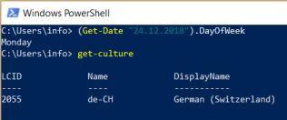
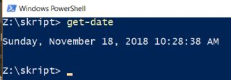
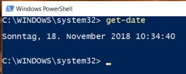

# PowerShell: Querbeet rund um das Datum

Notizen zu Powershell und Datum als Datentyp und Funktion.  Lernrepetition.  

Cmdlet "Get-Date" ist zuständig für Datumsinformationen. Mit ```get-date | get-member``` können die Funktionen aufgelistet werden. Z.B. ```(get-date).month```.  Alternativ kann man über eine Variable gehen:  

```
$datum = Get-Date
$datum.month
```

In Powershell sind alles Objekte. D.h. $datum ist keine Variable, sondern ein Objekt. Daher kann über die Variable die gleichen Methoden angewendet werden. Ich kann dem Objekt auch ein konkretes Datum vorgeben und z.B. fragen, was für ein Wochentag der 24. Dezember 2018 ist.

  

  

  

Natürlich muss das in Windows eingestellte Datum berücksichtigt werden. Ein Datum im US Format erwartet an der ersten Stelle den Monat. D.h. Werte über 12 führen zu einem Fehler. Das kann mit Get-Culture eingestellt werden. Dieser Windows 10 Computer ist von der Tastaturbelegung bis hin zu den Datumsformaten auf "Swiss German" eingestellt. Da ich als verwendete Sprache US Englisch auf dem Computer definiert habe, erfolgt die Ausgabe von Powershell in Englisch.  

Der Befehl kann auch über die "[Standard Numeric Format Strings](https://docs.microsoft.com/en-us/dotnet/standard/base-types/standard-numeric-format-strings)" formatiert (Gross- / Kleinschreibung beachten) werden:  

```
C:\Users\info> Get-Date -Format F  
C:\Users\info> Get-Date -Format f
```

Das Argument Format kann auch mit .NET [- DateTimeFormatInfo Class -](https://docs.microsoft.com/en-us/dotnet/api/system.globalization.datetimeformatinfo?view=netframework-4.7.2)] formatiert werden. Mit dem Argument -UFormat können Parameter im Unix Format verwendet werden. Das verwenden des Format Argumentes garantiert, dass unabhängig von den Ländereinstellungen in Windows die Angabe im gleichen Format angezeigt wird.  

`Get-Date -Format yyyy-MM-dd`  

Welcher Wochentag war der erste Tag des laufenden Monates?  
``Get-Date –Day 1 –Hour 0 –Minute 0 –Second 0``  

Wieviele Stunden des aktuellen Tages sind bereits vergangen?
`(Get-Date).TimeOfDay.TotalHours`

Das Datum des Computers kann mit dem Cmdlet ["Set-Date"](https://docs.microsoft.com/en-us/powershell/module/microsoft.powershell.utility/Measure-Command?view=powershell-5.1) gesetzt werden.  

Das Datumsobjekt kann über die Methode "tostring" zu einem Text ("String") umgewandelt werden:  
`
([datetime]::now).tostring("dd.MM.yyyy HH:mm:ss")  
([datetime]::now).tostring("MM\/dd\/yyyy|HH:mm:ss.fff")  
`

Das Cmdlet "Get-Date" unterstützt kein Remoting. Dafür ist das [Invoke Command](https://docs.microsoft.com/de-de/powershell/module/microsoft.powershell.core/invoke-command?view=powershell-6) erforderlich.  

Die Microsoft Tech Net Serie ["Scripting Guide"](https://blogs.technet.microsoft.com/heyscriptingguy/2013/11/11/powertip-use-powershell-to-format-dates/) hat noch einen Überblick geschrieben

# Timespan Objekt  

Ein TimeSpan Wert stellt ein Zeitintervall dar und kann als eine bestimmte Anzahl von Tagen, Stunden, Minuten, Sekunden und Millisekunden ausgedrückt werden. Da es sich um eine allgemeine Intervall ohne Verweis auf einen bestimmten Start- oder Endpunkt darstellt, kann nicht es im Hinblick auf Jahren und Monaten, die eine Variable Anzahl von Tagen jeweils ausgedrückt werden. Es unterscheidet sich von einem DateTime -Wert, der ein Datum und Uhrzeit ohne Verweis auf eine bestimmte Zeitzone darstellt, oder ein DateTimeOffset Wert, der einem bestimmten Zeitpunkt darstellt.  

Beispiele:  
"""
Wann wurde die Datei zuletzt geändert?    new-timespan -start (ls .\.gitconfig).lastwritetime
"""


# Rechnen

Welcher Wochentag dieses Jahr Wehnachten ist, wurde weiter oben bereits angezeigt. Mit "rechnen" kann man auch ermitteln welcher Wochentag Sylvester dieses Jahr sein wird:  

`
(Get-Date "24.12.2018").AddDays(7).DayOfWeek
(Get-Date "24.12.2018").AddDays(7).AddHours(7)
`

Weitere verwandte Funktionen:  

* AddDays
* AddHours
* AddMilliseconds
* AddMinutes
* AddMonths
* AddSeconds  
* AddTicks
* AddYears  

Und wieviele Tage es noch bis Weihnachten sind, ermittelt dieser Befehl:  

```
(Get-Date "24.12.2018").DayOfYear - (Get-Date).DayOfYear
```

Wie bekannt, kann das Resultat der Rechnung formatiert ausgegeben werden.
```
C:\Users\info> (Get-Date "24.12.2018").AddDays(7).ToString(“dd.MM.yyyy”)
(Get-Date "24.12.2018").AddDays(7).AddHours(7).ToString(“dd.MM.yyyy_HH:mm”)
```

# Codesnippets


## Jahrestag in Datum konvertieren

```
$TempDate = ([datetime]"01/01/$((Get-Date).Year)").AddDays(140-1) $ShortDate = 
$TempDate.ToShortDateString()
```

## Laufzeit eines Skriptes messen  

```
$Start = Get-Date
# Skript das durchläuft
$Ende = Get-Date
$Resultat = $Start - $Ende
write-host "$($Resultat.Hours)h:$($Resultat.Minutes)m:$($Resultat.Seconds)s"
```
In diesem Zusammenhang sind noch folgende Funktionen relevant:
* TotalMilliseconds
* TotalMinutes
* TotalHours
* TotalDays

Mit dem [Measure Command / Objekt}(https://docs.microsoft.com/en-us/powershell/module/microsoft.powershell.utility/Measure-Command?view=powershell-5.1) kann direkt die Laufzeit eines Skriptes ermittelt werden.  


# Quellen

* [WindowsPro.de: Get-Date: Datum berechnen und formatieren in Powershell](https://www.windowspro.de/script/datum-berechnen-formatieren-powershell-get-date)  
* [Microsoft Docs: Get-Date](https://docs.microsoft.com/en-us/powershell/module/microsoft.powershell.utility/get-date?view=powershell-6) 
* [MS Windows PowerShell Tip of the Week: Formatting Numbers and Dates Using the CultureInfo Object](https://docs.microsoft.com/en-us/previous-versions/windows/it-pro/windows-powershell-1.0/ff730954(v%3dtechnet.10))
* [TimeSpan Objekt](https://docs.microsoft.com/de-de/dotnet/api/system.timespan?view=netframework-4.7.2)