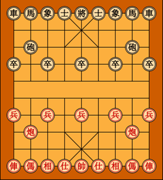
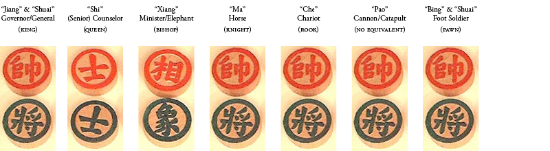

# Xiangqi - chinesisches Schach

Die beliebten Spiele sind ebenso Teil der Kultur und gibt einem einen Einblick in die Kultur eines Volkes bzw. einer Sprachgruppe. Daher habe ich ein wenig Zeit investiert und recherchiert, was in China gespielt wird. Schnell war für mich klar, dass das chinesische Schach («Xiangqi») für ich den grössten Reiz hat.  
In China sind es drei Spiele die grosse Verbreitung haben:
*	[«Kampf dem Lehnsherren» / «Dòu Dìzhǔ»](https://de.wikipedia.org/wiki/Dou_di_zhu)
*	[Mahjong](https://djini.de/mahjong/)
*	[«Xiangqi» - chinesisches Schach](http://www.proxima-centauri.de/xiangqi/xiangqi.pdf)  

Zum Spiel [«Kampf dem Lehnsherren»](https://de.wikipedia.org/wiki/Dou_di_zhu) hat der Blog [«Fit für China»](https://www.youtube.com/watch?v=Q5yOVfST1cg) ein Videotutorial erstellt. «Mahjong» ist auch bei uns bekannt. Die Windows App ist sehr schön gemacht und mit dem Windows Klassiker «F1» wird einem das Spiel erklärt. Da ich Brettspiele bevorzuge, habe ich mir das «chinesische Schach» näher angeschaut. Wenn man das westliche Schach als Spieler kennt, fällt einem der Einstieg erheblich leichter. Das nicht mehr erhältliche Buch «Chinesisches / koreanisches Schach» von M. David Wurman (ISBN 3-817-1166-5)liefert einen leicht lesbaren Einstieg. Für meinen Geschmack etwas zu schwärmerisch, zu wenig auf das eigentliche Spiel bezogen.  

Die zwei Parteien sind durch die Farben «rot» und «schwarz» bzw. «grün» gekennzeichnet. Wenn die Farbe mit der Zeit abblättert, spielt das keine Rolle da die Figuren unterschiedliche Beschriftungen haben. In den chinesischen Karten ist «Süden» oben und «Norden» unten. 

Daher lautet die Anweisung, die roten Steine im Norden und die schwarzen Steine im Süden aufzustellen. Das Brett ist oft ein einfaches Stück Reispapier. In der Mitte des Brettes ist ein Fluss («gelber Fluss») den Spielfiguren wie die Elefanten nicht überqueren dürfen. Die Schachfiguren sind i.d.R. flache Steine, wie wir es von Mühle dder Dame kennen. 

Da das Spiel international immer beliebter wird, werden die Spielfiguren auch auch in westlicher (klassischem Schach angelehnt) Variante verwendet:  

Für die ersten Versuche kann auf der Website [Printableboardgames](www.printableboardgames.net) ein Spielbrett mit Figuren auf einem (Farb-) drucker ausgedruckt werden. Die schwarzen Figuren sind hier absichtlich aus Sicht des südlichen Spielers (rot) angeordnet. Anders als beim westlichen Schach sind die Schriftzeichen auf den Steinen unterschiedlich. Natürlich heisst das auch, dass die selbe Spielfigur abhängig von der Farbe einen anderen Namen hat. Z.B. Feldherr und General. Wie so oft bietet dazu die englische Wikipedia Seite mehr Informationen als die deutsche Entsprechung. D.h. auch wenn die Farbe (rot und grün bzw schwarz) mit der Zeit verblasst, kann man die [Figuren](https://de.wikipedia.org/wiki/Xiangqi#Zugregel) noch immmer eindeutig indentifizieren.  

Die Notation ist mit dem westlichen Schach vergleichbar. Wie ein Spiel eines Meisters aussieht, kann man anhand dieses [Applets](http://www.01xq.com/e_game_view.asp?id=002023DFA3C216) grafisch erleben. Einfach auf der rechten Seite auf die notierten Züge klicken und sehen, welcher Stein sich rechts bewegt. Welche Art Figur bewegt wurde, kann man anhand der Beschriftung und z.B. der Wikipedia Seite nachvollziehen. Was für den westlichen Schach spielenden verwirrend ist, ist der Sachverhalt das die Figuren auf Linien bzw. deren Schnittpunkte stehen. Daher ist es für die Orientierung hilfreich, wenn die neun (nicht acht) Linien nummeriert sind. Das hilft einem bei der Orientierung. 

Als Kind spielte ich Mühle, Dame und Schach. Jahrzehnte später kam ich in Kontakt mit den südostasiatischen Brettspielen "Xiangqi", "Go" und "Shogi". Die Komplexität und Rafinesse der asiatischen Spiele verwirrt, frustriert und motiviert mich stets auf das Neue.  

# Quellen

*   [OKBNC OK Business News China: Einführung in chinesisches Schach](https://www.youtube.com/playlist?list=PL5B6A113672C44287)
*   [WikiHow: Chinesisches Schach spielen](https://de.wikihow.com/Chinesisches-Schach-spielen)
*   [YouTube: Chinese Chess Strategy for Beginner](https://www.youtube.com/watch?v=koRrZ1jXxug)
*   [Chessvariants.com - xiangqi](http://www.chessvariants.com/xiangqi.html)
*	[Deutscher Xiangqi Bund](http://www.chinaschach.de/)
*	[Download Chinese Chess Printable Board Game](http://www.printableboardgames.net/click2.php)
*	[Einführung in das chinesische Schach](http://www.stosszahn-franken.de/xq-kurs/index.html)
*	[Einführung vom deutschen Verband](http://www.chinaschach.de/dxbintro.html)
*   [YouTube: The Elephant Opening](https://www.youtube.com/watch?v=JTiIKn4Cbq4&list=PLB5uEvgfa_-FUKfpBvn5y-iGnZEH_mQPH)
*   [Rainer Schmidt: Diverse Dokumente](http://www.chinaschach.de/akxqg/)
*   [Xiangqi: "Die Mattkrallen der Shaolin"](https://de.chessbase.com/post/xiangqi-die-mattkrallen-der-shaolin-)
*   [YouTube: Singapore Xiangqi Academy](https://www.youtube.com/channel/UCRyUYJi1GeYXxgqc0ZuZd7Q/videos)
*   [YouTube: SA Chess: Diverse Playlists](https://www.youtube.com/user/chengdishen/playlists)
*	[Figurenset Vorlagen für 3D Drucker](http://www.yeggi.com/q/xiangqi/?s=tt)
*	[Gizmos Freeware: Best Free Chinese Chess](http://www.techsupportalert.com/content/best-free-computer-chinese-chess.htm#Qianhong)
*	[History xiangqi](http://ocastudios.com/classics/xiangqi/)
*	[hoxchess - An C++ Open source Xiangqi (Chinese Chess) Program](https://code.google.com/p/hoxchess/)
*	[Schachfiguren selber herstellen](http://www.instructables.com/id/Lets-learn-to-learn-how-to-make-Chinese-Chess-Set/)
*	[Software Chess Wizzard](http://www.chess-wizard.com/)
*	[Wikipedia-DE:Xiangqi](https://de.wikipedia.org/wiki/Xiangqi)
*	[Wikipedia-EN:Xiangqi](https://en.wikipedia.org/wiki/Xiangqi)
*   [Play with someone](https://www.chessvariants.com/play/pbm/play.php?game=Chinese+Chess&settings=GB-set)
*   [Online Play](https://www.playok.com/en/xiangqi/)
*   [Musterpartien (Logs)](http://www.01xq.com)
*	[WinBoard Xiangqi install configured with Xiangqi as default variant](http://hgm.nubati.net/WinBoard-XQ.exe)
*	[Windows Schachprogrmm (chinesisch)](http://sourceforge.net/projects/xqwizard/files/3.%20Qianhong%20Xiangqi/3-1.%20Qianhong%20Xiangqi%203.5.0%20(English%20and%20Chinese)/)
*	[WinSoftware Qianhong 3.5](http://qianhong.software.informer.com/3.5/)

