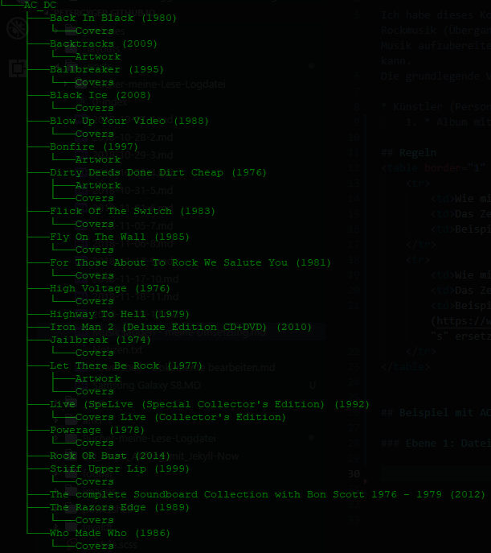
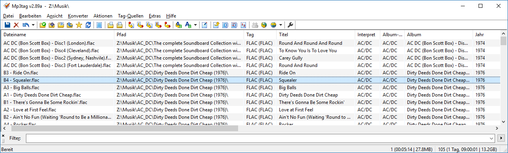
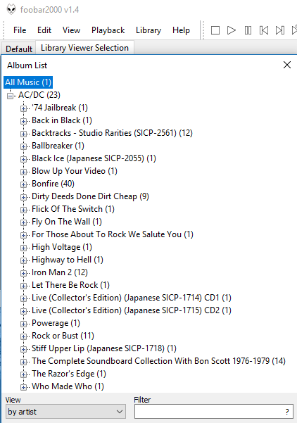

# Musik taggen - meine Umsetzung

Notizen zum taggen meiner Musik. Die Grundlage sind ID3 Tags. Mein Ziel ist es die Musik in den Applikationen "Kodi" und "Foobar2000" zu organisieren. Zur Verwaltung der Musik und Tags verwende ich die Software [MP3TAG](https://www.mp3tag.de). Man kann selber Tags definieren, um bestimmte Informationen abzubilden. Jedoch sind nur wenige Player wie z.B. Foobar 2000 in der Lage diese anzuzeigen.  Einen Einstieg in die Abhängigkeit der verwendeten ID3 Tags und Programem bietet diese [Website](http://help.mp3tag.de/main_tags.html) der Software "MP3Tag".  

## Meta

Erstellt:		20. November 2018  
Modifiziert:	20. November 2018  

## Detail

Ich habe dieses Konzept Schritt um Schritt aufgebaut, verfeinert und überarbeitet. D.h. ich habe mit moderner Musik (Rockmusik etc.) angefangen, da hier weniger Informationen als z.B. bei klassischer Musik aufzubereiten sind. Entscheidend bleibt, wie ich die Informationen in Foobar2000 und Kodi nutzen kann.  
Die grundlegende Verzeichnisstruktur sieht so aus:  

* Künstler (Person / Gruppe)
    * Album mit Jahreszahl. Syntax: Albumnamen, Leerschlag und Jahreszahl in runden Klammern
        * Alben mit mehreren Datenträgern wird in einem Verzeichnis gespeichert. Die Identifikation der Datenträger erfolgt über Tags.    
        * Wenn ein Album im gleichen Jahr erschienen ist, wird nach nach dem Namen des Albums nebst der Jahreszahl ein zusätzicher Hinweis eingefügt. Bsp: "High Voltage" von AC/DC gab es in mindestens 2 Versionen: "australisch" und "international". Wenn beide Alben in der Sammlung sind, wird die australische Version so benannt: "High Voltage (aus) (1976)
        * Ältere Aufnahmen werden z.T. "remastered" und neu veröffentlicht. In diesem Fall lösche ich die Orginale Aufnahme und verwende nur die "remastered" Version. Ohne Hinweis im Verzeichnisnamen. Argumente:  
        * Die durchschnittliche Qualität der remastered Alben ist gut. D.h. die Qualität des Orginals bleibt erhalten. Musik erhält von mir nicht so viel Zeit, dass ich diese Unterschiede heraus hören kann.
* Tags (Namenklatur: MP3Tag (en) / ID3v2.3)
    * Album / TALB:         Name des Albums
    * Album Artist / TPE2:  Feld für die Namen spezieller Personen im Kontext des Albums. Bsp. der Leadsänger von AC/DC. Der Wechsel von "Bon Scott" zu "Brian Johnson" ist im Tag "Albumartist" notiert.
    * Artist / TPE1:        Name des Künstlers bzw. der Gruppe
    * Comment / COMM:       Vermerke wie "remastered".
    * Compilation / TCMP:   Wenn es eine "Compilation ist, wird der Wert des Feldes auf "ja" gesetzt.
    * Composer / TCOM:      Für die klassische Musik primär relevant.
    * Conductor / TPE3:     Für die klassische Musik primär relevant.
    * Discnumber / TPOS:    Wenn ein Album aus mehreren Datenträgern besteht, wird die Nummer des Datenträgers (gemäss Albumcover) notiert.
    * Genre / TCON:         Musikstil. Granulierung variabel. D.h. z.B. das ich ein Genre Klassik verwende. Jedoch nicht differenziere zwischen Untergruppen wie "Wiener Klassik", "20. Jahrhundert", etc.
    * Title / TIT2:         Titel des Musikstückes
    * Track / TRCK:         Nummer des Stückes auf dem Album (Reihenfolge)
    * Year / TYER:          Jahr in dem das Album veröffentlicht wurde. "Remastered" bzw. Neuauflagen haben keinen Einfluss auf das Jahr.
    * "Live", "Single", "Compilation und "Bootleg" sind Albumvarianten. In der Zukunft werde ich einen Tag nutzen, um solche Alben zu kennzeichnen.  

Hinweis: Die Tags sind nicht mit Variablen oder Datenbankfelder zu vergleichen. Man kann in ein Datumsfeld wie "Year" auch einen Text wie "Unbekannt" hinein schreiben. Man kann das Feld "Year" auch als Datumsfeld interpretieren und das vollständige Datum (T/M/J) festhalten. In diesem Konezpt enthält das Feld das Jahr (gregorianischer Kalender) oder bleibt leer.
  
## Regeln
<table>
    <tr>
        <td>Wie mit nicht darstellbaren Zeichen umgehen?</td>
        <td>Das Zeichen mit einem _ (Unterstrich) ersetzen.</td>
        <td>Beispiel: AC_DC</td>
    </tr>
    <tr>
        <td>Wie mit "falschen" Zeichen umgehen</td>
        <td>Das Zeichen sinngemäss ("Best Practice") ersetzen</td>
        <td>Beispiel: Das Eszett wird durch 2 "s" ersetzt. </td>
    </tr>
    <tr>
        <td>FLAC Format - ganze Alben</td>
        <td>Medien im Flac Format können sowohl ganze Alben oder einzelne Dateien umfassen</td>
        <td></td>
    </tr>   
</table>
   
## Beispiel mit AC/DC  

### Ebene 1: Dateisystem

  

Im Ordner "AC/DC" hat es eine JPG Grafik namens "Artist.jpg". In jedem Verzeichnis hat es optional folgende Dateien:  
* Front Cover:    cover.jpg
* Back cover:     back.jpg
* Disc:           disc.jpg  

Die Musik ist wahlweise in MP3 oder Flacformat gespeichert.  

### Tags
Das Programm MP3Tag bietet eine leicht verständliche Übersicht über die verwendeten Tags und welche Werte sie beinhalten:  

 

### Applikationen

#### Foobar2000  

Die Albumlist von Foobar2000 zeigt das Verzeichnis "AC/DC" wie vorgesehen an.  
 

#### Kodi

Kodi ist für Filme ausgelegt. Musik war immer ein Stiefkind. 

# Quellen

* [ID3](http://id3.org)
* 

