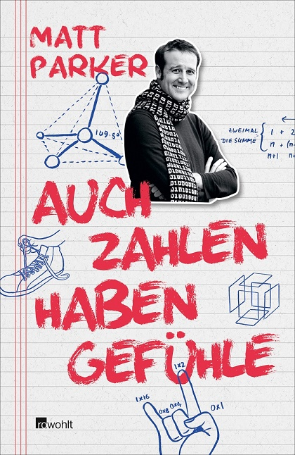
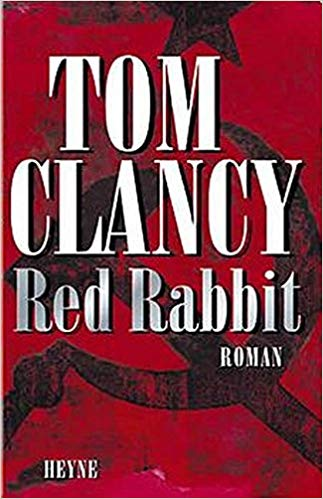
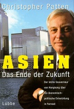
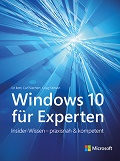
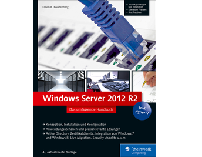

# Meine Lese Logdatei

Meine Logdatei mit Notizen und Stichworten zu den gelesenen Büchern, Magazinen, etc..  Die Software Calibre ist die Software mit der ich die Bücher (Digital und Papier) verwalte. D.h. zu jedem Buch den Vermerk gelesen mit Datum, Stichworten, Teil einer Serie, etc.  

Trotz wiederholter Anfrage bietet kein schweizer Buchhändler eine Wunschliste für die Kunden an. Daher hier der Verweis auf meine Amazon [Wunschliste](https://www.amazon.de/gp/registry/wishlist?ref=nav_wishlist_btn)  

# Dezember 2018  

## Windows 10 Reparaturhandbuch

[

| Titel:    | Windows 10 Reparaturhandbuch | 
| Autor:    | Christian Immler   | 
| Verlag:   | FRANZIS Verlag GmbH   | 
| ISBN:     | 978-3645606301

Das Buch ist eine Betty Bossy Rezeptsammlung. Alles wird an der Oberfläche behandelt. Ereignisanzeige (Eventlog) wird nicht erwähnt. Tools werden zu Websites von Computerzeitschriften anstatt bekannten Anbietern wie Nirsoft oder SysInternals. Dennoch hat sich das durchlesen ausgezahlt, weilt die Möglichkeiten von Windows 10 vorgestellt werden. Wo der Profi mit CLI und "net use" oder "netsh" arbeitet, wird der Anwender in Tools von Windows 10 bzw. anderen GUI orientierten Drittanbieter Lösungen arbeiten.  
Und diese werden hier vorgestellt. Natürlich kann sich das lesen auch unterhaltsamer gestalten, in dem man gedanklich skizziert wie eine Lösung auf der CLI (Powershell / CMD) aussehen würde. 

## Auch Zahlen haben Gefühle

| Titel:    | Auch Zahlen haben Gefühle | 
| Autor:    | Matt Parker | 
| Verlag:   | Rowohlt Verlag | 
| ISBN:     | 978-3-498-05241-6

„Physik ist wie Sex. Natürlich gibt es einige praktische Ergebnisse, aber deshalb tun wir es nicht.“ ―Richard Feynman. Was Feymann als Popstar der Physik darstellt, ist Daniel Jung oder Matt Parker für die Mathematik. Die MINT Fächer sind entscheident für die Zukunft der Gesellschaft und der Menschheit. Natürlich ist der Trend, dass der Schüler bzw. die Eltern den Lehrer für den Lernerfolg verantwortlich machen einfach dumm. Aber das viele Wege nach Rom führen und einige Schüler etwas mehr bzw. andere Didaktik benötigen, dafür spricht vieles. Siehe auch die [Medium.com Seite](https://medium.com/@DanielJung) von Daniel Jung. Auch bestandene, erfahrende Politiker wie [Willi Vollenweider](http://willivollenweider.ch/mint/index.html) setzen sich für die Förderung der Mintfächer ein. Leider werden diese Fächer zu oft in akademischer, abstrakter Form gelehrt.  

Dieses Buch sollte man mit Papier und Schreibwerkzeug und noch besser Internetzugang lesen. Der Spass ist garantiert - 100 Prozent Garantie. Dafür sorgen auch die Zeichnungen, die einem erklärt wie man "anders" eine Pizza oder Kuchen schneiden kann oder mit 10 Fingern auf entspannt auf 1023 zählen kann.

## Red Rabbit

| Titel:    | Red Rabbit | 
| Autor:    | Tom Clancy | 
| Verlag:   | Heyne Verlag   | 
| ISBN:     | 978-345386481

Vor mehr als 12 Jahren habe ich den Thriller zum ersten Mal gelesen. Auch die zweite Lesung bestätigt meine Erinnerung. Keine James Bond Action, sondern sehr gut recherchierte Details mit glaubwürdigen Figuren die in einem politischen Zirkus agieren. Wobei hier der Papst in Rom die Rolle als Ziel übernommen hat. Der Thriller ist wie ein guter Wein. Je näher der Schluss kommt, desto intensiver und heftiger werden die Eindrücke.  
Tom Clancy ist für mich der König der Thriller und seine Liebe zu den Fakten und Details ergänzen den Thrill perfekt, welcher in den Büchern aufgebaut wird.  

# November 2018  

## Born to run

 

| Titel:    | Born to run | 
| Autor:    | Bruce Springsteen   | 
| Verlag:   | Heyne Verlag   | 
| ISBN:     | 978-3-453-20131-6   | 

Mit der Musik von Bruce Springsteen bin ich aufgewachsen. Ich habe mehrere Bücher und Artikel über seine Musik und sein Leben gelesen. Das Buch spiegelt perfekt wieder was er ist: ein genialer Egomane. Ein Beispiel dafür, dass "Patti Scialfa" plötzlich als Ehefrau erwähnt wird. Noch nicht einmal "Sandy", die ihn zu dem wunderbaren gleichnamigen Song inspiriert hat, wird genauer beschrieben. Seine Beziehung zu Frauen, dürfte wahrscheinlich mit dem gängigen Klisches der heutigen Hip Hoper vergleichbar sein.  Kapitel 53 (!) - "Die rothaarige Revolution" stellt er seine aktuelle Ehefrau vor. Er ist ein Künstler wie Peter Maffay, die einfach alles tun und lassen können und immer von Ihrem Publikum geliebt werden. Es erinnert mich an den Film "Amadeus" von Miloš Forman, in dem sich Antonio Salieri von diesem genialen Kindskopf Mozart ärgern lassen muss.

Das Buch liefert neue Informationen zu der Entstehung der einzelnen Alben und zu den Bandmitglieder, den Managern und den Touren. Sein Leben ist ein wahnsinniger Rausch, er ist ein genialer (Live-) Musiker, Workaholic und seine Liveauftritte wie ["Live in Dublin"](http://brucespringsteen.net/albums/live-in-dublin-film) sind die beste Rockunterhaltung bzw. Folkunterhaltung die ich je gesehen habe. Rock'n Roll war immer schon Revolution. Das hat die Rockband Freiwild mit ["Opposition"¨(https://www.discogs.com/de/FreiWild-Opposition/release/7100619) eindrücklich und auf Weltklasseniveau bewiesen Das  Buch ist mit groser Schrift gedruckt und liefert 668 Seiten lang eine packende Lebensgeschichte, eines weissen Arbeiterkindes aus den ärmsten Schichten der US Bevölkerung, welches Dank einer Gitarre  den sozialen Aufstieg meistert. Mal sehen ob das Sprichwort Recht behält: "Man kann den Menschen aus dem Slums, aber nicht den Slum aus dem Menschen holen". Die Zukunft wird es weisen...

## Asien Das Ende der Zukunft

| Titel:    | Asien Das Ende der Zukunft | 
| Autor:    | Christopher Patten   | 
| Verlag:   | Lübbe Verlag   | 
| ISBN:     | 3-7857-0947-1   | 

Hongkong wurde von zwei grossartigen Kulturen gebaut. Keine andere mir bekannte Stadt, hat so starkes Erbe und Fundament von zwei verschiedenen Kontinenten vorzuweisen. Daher beobachte ich die Vorgänge in Hongkong mit grossem Interesse. Christopher Patten war der letzte Gouverneur vor der Übergabge ("Handover") an Hong Kong. Eng bedruckt auf über 370 Seiten beschreibt er diese fünf Jahre und seine Sicht auf die Verhandlungen. Anders als die typischen schweizer Politiker in den Verhandlungen mit der EU ging er nicht im Voraus auf die Knie und machte sich klein.  

> "Ich hatte meine Gouverneurszeit nicht damit verbracht, nach der Pfeife Pekings zu tanzen. Waren die Folgen für Hongkong fatal? Genau davor hatten unsere Kritiker 1992 und 1993 gewarnt. Der Zustand Hongkongs im Jahr 1997 war eine bessere Antwort auf diese Frage, als ich sie hätte liefern können. Wir waren für Hongkong eingetreten und hatten verspätet die Versprechen eingelöst, die ihm in Sachen Freiheit, Demokratie und Rechtsstaatlichkeit gemacht wurden waren." (Kapitel 2 - Seite 101)  

Eine spannende, anstregende Lektüre mit vielen Fakten, welche man idealerweise gleich im Internet recherchiert. Da wird die Geschichte gleich nochmals lebendiger.

## Alexander v. Humboldt und die Erfindung der Natur

  

| Titel:    | Alexander v. Humboldt und die Erfindung der Natur | 
| Autor:    | Andrea Wulf   | 
| Verlag:   | Bertelsmann Verlag   | 
| ISBN:     | 978-3-570-10206-0   | 

Spannende und historische Geschichte über das Leben Alexander von Humboldt. Kapitel 9 hat mir besonders gefallen. Nach fünfjähriger Reise mit dutzenden von Truhen voller wissenschaftlicher Fundstücke trifft er in Paris ein. Paris war zu der Zeit das Mekka der Wissenschaft, da dank der Revolution die Herrschaft der Religion überwunden war. Zugleich wird beschrieben wie sehr sich Paris in fünf Jahren geändert hat, da Napoleon als Diktator die Architektur und das politische Klima radikal verändert hat.  

Spannend auch die Kontakte mit Bolivar und anderen Persönlichkeiten der damaligen Zeit. Die Autorin schildert auch die Diskussionen mit seinem Bruder Wilhelm, der ihm laufend vorwirft sein Deutschtum zu verraten. Seine chronische Terminüberschreitung beim (parallelen) schreiben seiner Bücher und die Sorgen seiner Schwester um das finanzielle Überleben, sind spannender Teil dieser Biografie.

## Shitstorms Der Zusammenprall digitaler Kulturen

  

| Titel:    | Shitstorms Der Zusammenprall digitaler Kulturen | 
| Autor:    | Christian Stegbauer   | 
| Verlag:   | Springer Verlag   | 
| ISBN:     | 978-3-658-19955-5   | 

Was früher der Saubannerzug war, ist in der digitalen Welt der Shitstorm. In der postfaktischen Welt sind Emotionen und nicht Fakten bzw. Logik die Grundlage der Entscheidung. Wie das ein Professor aus Sicht seiner akademischen Welt das interpretiert, dass will ich wissen.  

Erpressern gibt man nicht nach, sonst öffnet man weiteren Erpressungen Tür und Tor. Das ist Konsens in aller Welt. Shitstorm ist dasselbe. Man kann wie die Swisscom einknicken, wenn sich ein Bestsellerautor wegen wiederholter Probleme in seiner Hausinstallation meldet und ihn hofieren, in dem man ihm sogar in seiner Landesprache zurück schreibt und sofort einen Techniker schickt. Brian Krebs ein anerkannter Security Forscher schrieb diesen Artikel "https://krebsonsecurity.com/2018/03/who-and-what-is-coinhive/" über eine nicht kommunizierte Miningsoftware auf einer Website. Da er das von Gruppen aus dem linken Spektrum verwendete Doxing (nennen der Namen und Adressen der Verantwortlichen) umsetze, war einer der Hauptgründe das ein Shitstorm losbrach. Seine Reaktion war sehr professionell. Er reichte vier Tage später einen weiteren Artikel nach: https://krebsonsecurity.com/2018/03/coinhive-expose-prompts-cancer-research-fundraiser/. Brians Krebs kann mit einem Mafiajäger verglichen werden. Seine Recherche gegen die DDOS Kriminellen haben seine bei Akamai gehostete Website einer gigantischen DDOS [Attacke](https://www.zdnet.com/article/krebs-on-security-booted-off-akamai-network-after-ddos-attack-proves-pricey/) ausgesetzt.  Akamai konnte dem Druck nicht standhalten und schaltete die Website des IT Sicherheitsexperten ab. Kurz und gut: er ist feuererprobt und hat Nerven wie Drahtseile. 

Das Buch ist eine geschichtliche und soziologische Analyse was ein Shitstorm ist. Wer sich dafür interessiert ist mit dem Buch gut bedient. Eine Erwartung hat der Autor erfüllt. Alle negativen Beispiele sind aus dem politischen Mitte-Rechts Bereich. Nicht demokratisches Verhalten von Linken Gruppen wird nie thematisiert. Ein Shitstorm bzw. das androhen - auch indirekt im Stile "Ich habe über 4000 Follower und werde das posten" - ist Gewalt. Also moralisch und rechtlich für eine offene Gesellschaft nicht akzeptabel.  

# Vor Oktober 2018

## Introducing Windows 10 for IT Professionals (Preview Edition)

  

| Titel:    | Introducing Windows 10 for IT Professionals (Preview Edition)  | 
| Autor:    | Ed Bott   | 
| Verlag:   | Microsoft Press   | 
| ISBN:     | none    | 

Eine von Ed Bott gewohnt gründliche Einführung. Basis des Buches war die Betaversion. Oft sind es Details wie das der Befehl „netsh“ zugunsten von Powershell cmdlets ausläuft, die man zu schätzen weiss.  

## Computernetze kompakt  

 

| Titel:    | Computernetze kompakt  | 
| Autor:    | Dr. Christian Baum   | 
| Verlag:   | Springer Verlag   | 
| ISBN:     | 978-3-662-57469-0    | 

Netzwerk	Christian Baun orientiert sich am OSI Modell und knapp und klar die wesentlichen Fakten durch.

Dank der konsequenten Ausrichtung auf dieses Modell verliert man den roten Faden nicht D.h. die Groborientierung ist gewährleistet.

## Als auf der Welt das Licht ausging  

 

| Titel:    | Als auf der Welt das Licht ausging  | 
| Autor:    | Tom Demarco   | 
| Verlag:   | Der Carl Hanser Verlag   | 
| ISBN:     | 978-3-446-43960-3    | 

"Der Termin" von Tom DeMarco ist wahrscheinlich der bekannteste IT und Projektmanagement Roman. Hier hat er eigentlich zwei Romane zusammen genommen. Teil 1 schildert die Entwicklung die die Wissenschaftler zwang den Stecker zu ziehen. Teil 2 ist der Aufbau der neuen Gesellschaft. Trotz Alter und amerikanischer Herkunft ist Teil  2 nichts für prüde Leser. Der 2 Teil hat auf mich schwelgerisch und konzeptlos gewirkt. Und der Abschluss des Buches passt exakt zu diesem Eindruck.

## Windows 10 für Experten  

 

| Titel:    | Windows 10 für Experten  | 
| Autor:    | Ed Bott   | 
| Verlag:   | Microsoft Press   | 
| ISBN:     | 978-3-86490-418-9    | 

Flüssig geschriebener Überflug über Windows 10 für Fortgeschrittene. Das Buch ist in Teile, diese wiederum in Kapitel aufgegliedert. Teil 4 ist für die Experten mit vielen wertvollen Informationen. Sehr zu empfehlen.  

### Leseproben:  

* [Neuerungen in Windows 10](https://www.dpunkt.de/common/leseproben//12616/2_Neuerungen%20in%20Windows%2010.pdf)
* [Schützen von Windows 10-Geräten](https://www.dpunkt.de/common/leseproben//12616/3_Sch%C3%BCtzen%20von%20Windows%2010-Ger%C3%A4ten.pdf)
* [Verwenden der Systemverwaltung](https://www.dpunkt.de/common/leseproben//12321/3_Verwenden%20der%20Systemverwaltung.pdf)
* [Automatisieren von Windows 10](https://www.dpunkt.de/common/leseproben//12321/4_Automatisieren%20von%20Windows%2010.pdf)

## Windows Server 2012 R2 - Das umfassende Handbuch

 

| Titel:    | Windows Server 2012 R2 - Das umfassende Handbuch  | 
| Autor:    | Ulrich B. Boddenberg   | 
| Verlag:   | Rheinwerk Verlag   | 
| ISBN:     | ISBN 978-3-8362-2013-2    | 

Umfassende Einführung in Windows Server 2012. Ideal für Einsteiger die sorgfältig recherchierte und sorgfältig publizierte Informationen suchen. Wird vom Verlag in der Reihe <Open Book> kostenlos online angeboten. Aber... wer einmal ein gedrucktes Buch aus dem Rheinwerk Verlag in den Fingern hatte, wird nie wieder darauf verzichten wollen. Das ist Buchdruckkunst vom Feinsten. Etwas was es im 21. Jahrhundert gar nicht mehr geben dürfte. Sehr zu empfehlen.  

 

| Titel:    | Richter Di: Geisterspuk in Peng-Lai  | 
| Autor:    | Robert van Gulik   | 
| Verlag:   | Diogenes Verlag   | 
| ISBN:     | ISBN 978-3-2572-1622-6    | 

Robert van Gulik war Sinologe und hat mit dem Roman „Geisterspuk in Peng-Lai“ ist eine sehr sachkundige Sherlock Holmes Variante in das chinesische Mittelalter spielen lassen. Dieses Buch ist der erste Fall den Di Jen-dsiä zu lösen hat. Neben spannen Fällen bietet der Roman zwei edle Räuber (a la Robin Hood), welche von der Persönlichkeit Richters Di so übermannt werden, dass sie in seine Dienste treten. Präzise gezeichnete Charaktere, ein wenig "Action" und "Erotik" und parallel laufende Handlungsstränge die sich beschleunigen. Spannend bis zur letzten Seite, welche viel zu schnell erreicht ist...
 

