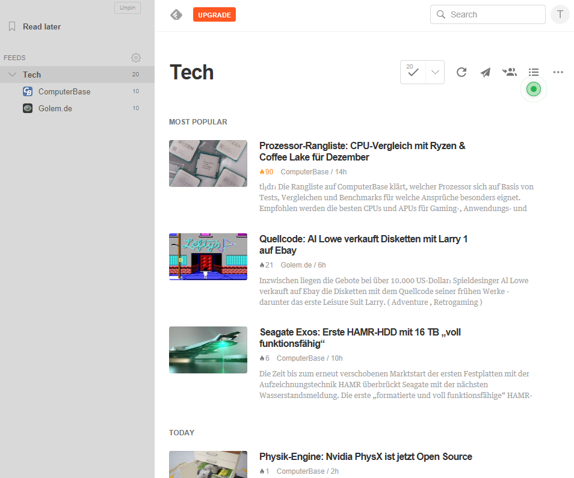
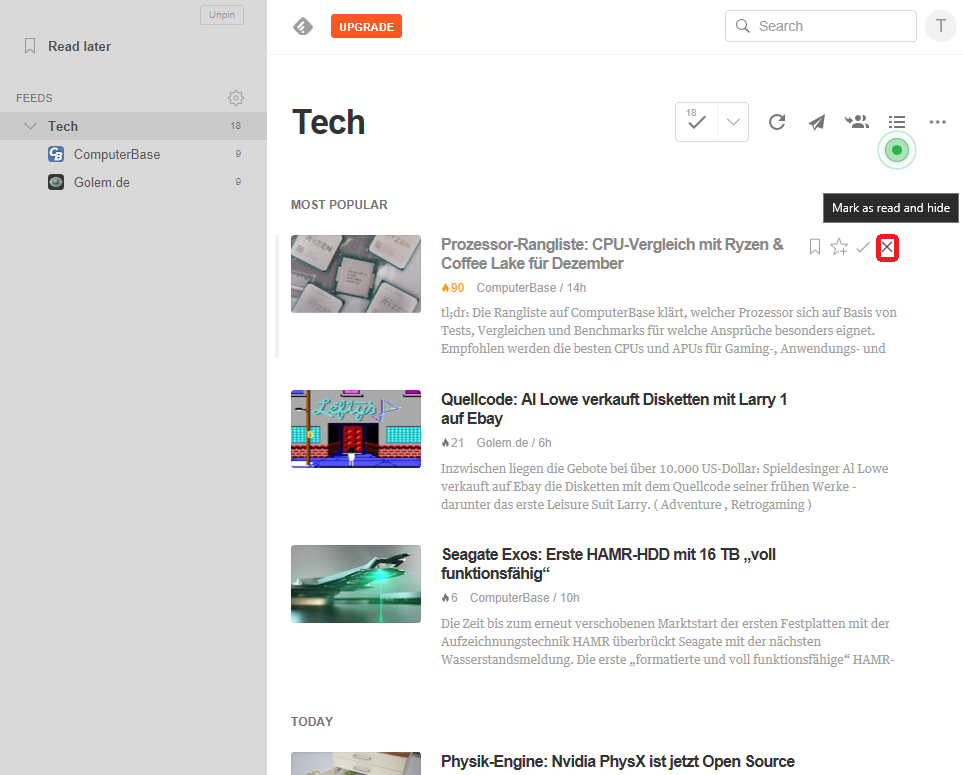

# RSS mit Feedly

RSS sind die richtige Antwort auf Informationsblase und Fakenews. Feedly ist ein RSS Reader mit dem ich sehr gute Ergebnisse erziele und daher hier vorstelle.  

## Was ist RSS

RSS ist ein Akronym. Es steht für "Rich Site Summary" bzw. "Really Simple Syndication".  Die Firma ["Userland"](http://rss.userland.com) entwickelte die aktuelle Version von RSS und änderte das Akronym in "Really Simple Syndication".  

## Feedly - ein RSS Reader

Meine Erfahrung hat mich gelehrt, dass "eierlegende Wollmichsauen" nie die qualitativ bessere Lösung ist. Notbehelf bzw. als sekundäres Tool verwendbar - mehr nicht. So habe ich nie die RSS Feeds mit dem Browser oder MS Outlook verwaltet. [Feedly](https://feedly.com) hat mich über Jahre hinweg überzeugt. Sowohl technisch als ich in der Art wie Firma kommuniziert. Lediglich der Sachverhalt, dass die Pro Version 65 pro Jahr kostet, ist für eine Privatperson jenseits der Schmerzgrenze. Ich habe die Pro Version ein Jahr getestet, um die Erfahrung zu haben, was ein professioneller RSS Reader zu leisten vermag.  

Im Internet hat es viele Informationen zu Feedly. Ein schöne Einführung findet man auf YouTube.com: [Socialmedia Doktor: Feedly einrichten - Anleitung für den RSS-Feed Reader](https://www.youtube.com/watch?v=ULUldWixqzw). Die Oberfläche wird nur in englischer Sprache angeboten. Für mich kein Nachteil, da ich englischesprachige Benutzerschnittstellen bevorzuge. Die Browser Addins um RSS Quellen hinzuzufügen verwende ich nicht, da ich meinen Browser nicht mit Software Dritter belaste. Sowieso wenn der Vorteil so gering ist.  

Nach dem erstellen eines Feddly Accountes präsentiert sich Feedly in der Grundansicht. In den Einstellungen ist konfiguriert, dass nur die nicht gelesenen Artikel angezeigt werden.   
  

In diesem Beispiel habe ich die RSS Streams von "Golem" und "Computerbase" einem Feed (in Feedly kann ein RSS Stream nur in einem Feed gespeichert werden) gespeichert.  
  

Nun kann man die Artikel überfliegen, lesen was einem interessiert und den Rest als "gelesen" ("Mark all as read") markieren . Dadurch werden die Artikel in Zukunft ausgeblendet. Das tritt ebenfalls ein, wenn man einen Artikel gelesen hat. Alternativ kann man über das "X" im Artikel den Post sofort auf "gelesen" setzen und sofort ausblenden lassen.  
  

Das ist der elementare Ablauf in der Nutzung des RSS Readers. Man prüft von Zeit zu Zeit die nicht gelesenen Artikel, liest was einem interessiert und die restlichen Artikel setzt man auf "gelesen".

Wenn ein Artikel offen ("angeklickt") ist, werden weitere weitere Funktionen angeboten. Einerseits in Form der Toolbar über dem Artikel, andererseits kann am Ende des Artikels ("Visit Website") die Website aufgerufen werden. Für viele Websits sind die RSS Feeds Mittel zum Zweck, um mehr Besucher auf die Website zu ziehen. D.h. das einige Feeds nur einen Teil der Informationen in den RSS Feed packen.  
  

Die vier Symbole die oben rechts über jeden Artikel stehen, beinhalten noch zwei zusätzliche Funktionen:  
*  ["Read later"]()  
*  ["Save to Board"]()  

### "Read later"

### "Save to Board"

## Quellen
* [Feedly Knowledge Base](https://feedly.uservoice.com/knowledgebase)
* [Feedly Blog](https://blog.feedly.com)
* [Vimeo: Feedly Channel](https://vimeo.com/feedly)

