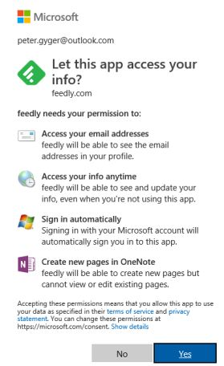

# RSS mit Feedly

RSS sind die richtige Antwort auf Informationsblase und Fakenews. Feedly ist ein RSS Reader mit dem ich sehr gute Ergebnisse erziele und daher hier vorstelle.  

## Was ist RSS

RSS ist ein Akronym. Es steht für "Rich Site Summary" bzw. "Really Simple Syndication".  Die Firma ["Userland"](http://rss.userland.com) entwickelte die aktuelle Version von RSS und änderte das Akronym in "Really Simple Syndication".  

## Feedly - ein RSS Reader

Meine Erfahrung hat mich gelehrt, dass "eierlegende Wollmichsauen" nie die qualitativ bessere Lösung ist. Notbehelf bzw. als sekundäres Tool verwendbar - mehr nicht. So habe ich nie die RSS Feeds mit dem Browser oder MS Outlook verwaltet. [Feedly](https://feedly.com) hat mich über Jahre hinweg überzeugt. Sowohl technisch als ich in der Art wie Firma kommuniziert. Lediglich der Sachverhalt, dass die Pro Version 65 pro Jahr kostet, ist für eine Privatperson jenseits der Schmerzgrenze. Analog Netflix müsste man prüfen, ob sich mehrere Teilnehmer über einen Vertrag einklinken können. Ich habe die Pro Version dieses Jahr getestet, um die Erfahrung zu haben, was ein professioneller RSS Reader zu leisten vermag. Dieser Artikel bezieht sich auf die Free Version, welche ich für Recherchen wie diese nutze.   

Im Internet hat es viele Informationen zu Feedly. Ein schöne Einführung findet man auf YouTube.com: [Socialmedia Doktor: Feedly einrichten - Anleitung für den RSS-Feed Reader](https://www.youtube.com/watch?v=ULUldWixqzw). Die Oberfläche wird nur in englischer Sprache angeboten. Für mich kein Nachteil, da ich englischesprachige Benutzerschnittstellen bevorzuge. Die Browser Addins um RSS Quellen hinzuzufügen verwende ich nicht, da ich meinen Browser nicht mit Software Dritter belaste. Sowieso wenn der Vorteil so gering ist. Twitter Accounts können über den Namen direkt hinzugefügt werden. Praktisch, wenn eine Quelle anstatt RSS einen Twitterfeed anbietet.  
  

Nach dem erstellen eines Feddly Accountes präsentiert sich Feedly in der Grundansicht. In den Einstellungen ist konfiguriert, dass nur die nicht gelesenen Artikel angezeigt werden.   
  

In diesem Beispiel habe ich die RSS Streams von "Golem" und "Computerbase" einem Feed (in Feedly kann ein RSS Stream nur in einem Feed gespeichert werden) gespeichert.  
  

Nun kann man die Artikel überfliegen, lesen was einem interessiert und den Rest als "gelesen" ("Mark all as read") markieren . Dadurch werden die Artikel in Zukunft ausgeblendet. Das tritt ebenfalls ein, wenn man einen Artikel gelesen hat. Alternativ kann man über das "X" im Artikel den Post sofort auf "gelesen" setzen und sofort ausblenden lassen.  
  

Das ist der elementare Ablauf in der Nutzung des RSS Readers. Man prüft von Zeit zu Zeit die nicht gelesenen Artikel, liest was einem interessiert und die restlichen Artikel setzt man auf "gelesen". Analog einer Zeitung oder einem Magazin.  Wahrscheinlich wird das für geschätzt 85% der Anwender das Szenario sein. Von den Anwendern, welche sich Artikel zum lesen vormerken ("Read Later"), werden viele die Artikel nicht lesen. Analog den gekaufen und nicht gespielten Spielen auf Steam, nicht gelesenen Büchern im Schrank, etc.  

Nachfolgen beschreibe ich die weiteführenden Funktionen und wenn noch Zeit ist, wie ich diese einsetze.  

Die vier Symbole die oben rechts über jeden Artikel stehen, beinhalten noch zwei zusätzliche Funktionen:  
*  "Read later"       
*  "Save to Board"    

Wenn ein Artikel offen ("angeklickt") ist, werden weitere weitere Funktionen angeboten. Einerseits in Form der Toolbar über dem Artikel, andererseits kann am Ende des Artikels ("Visit Website") die Website aufgerufen werden. Für viele Websits sind die RSS Feeds Mittel zum Zweck, um mehr Besucher auf die Website zu ziehen. D.h. das einige Feeds nur einen Teil der Informationen in den RSS Feed packen ("Teaser").  
  

In der Magazin Ansicht sieht man nur vier Symbole, die ersten zwei bespreche ich nachfolgend.  

### "Read later"

Nach einem Klick auf das "Read later" Symbol, wird dieses grün eingefärbt. Der Artikel verschwindet aus der Übersicht und wird links im Abschnitt "Read Later" angezeigt. Nach einem erneuten Klick auf das "Read later" Symbol wird der Artikel wieder entfernt. In dieser Bildschirmkopie sieht man auch die Werbung (RSS Feedpost darunter) die in der Freeversion eingeblendet wird.

### "Save to Board"

Ein Klick auf den Stern führt beim ersten Mal zum erstellen eines Boards. In diesem Beispiel erstelle ich ein Board namens "Games".  
  
Danach sieht man auf der linken Seite einen neuen Abschnitt namens "Boards". Darin das erstelle Board "Games".  
  

Ein Feedly Blogppost von 2015 zeigt die verschiedenen Möglichkeiten RSS Artikel zu [speichern](https://blog.feedly.com/seven-ways-to-save-articles-that-you-read-in-feedly/). In der kostenlosen Version ist man aktuell auf drei Boards beschränkt. Man sollte auch bedenken, dass wenn der RSS Feed nicht den vollständigen Artikel enthält, dass der Klick auf "Visit Website" zu einem HTTP 404 Fehler führt. Speziell bei den öffentlich rechtlichen Angeboten, welche per Gesetzt zum lösen nach bestimmten Fristen gezwungen sind. Der zweite Punkt ist, dass man externe Inhalt abruft. Der Inhalt kann jederzeit geändert werden.

### Extern speichern

"Save to Board" war eine Kampfansage von Feedly an externe Anbieter von gespeicherten Artikel wie Pocket. Mein bevorzugter Dienst "One Note" ist auch eine Option, jedoch gebe ich Anmeldedaten nicht an Dritte weiter. D.h. ich empfehle einen eigenen MS Outlook Account dafür zu erstellen.  
  

## Abschliessend

Feedly kann über die Tastatur gesteuert werden. Die Tastaturkürzel kann man sich mit der Fragezeichen Taste (mit Umschalt bzw. Shift - Taste) auf der Tastatur anzeigen lassen.  
Die Feedly App ist effizient. Ich nutze die [Android](https://play.google.com/store/apps/details?id=com.devhd.feedly&hl=en_US) Version und habe neben den E-Books zusätzliches Lesefutter.  
Abonnierte [YouTube Kanäle](https://www.youtube.com/subscription_manager) kann man in YouTube direkt in das OMPL (XML) Format speichern und in Feedly als OMPL Format Datei importieren.  
Social Media Kanäle lassen sich über Webservices - z.B. FetchRSS und Queryfeed - als RSS Quelle transformieren.  
[Newsletter](https://www.kill-the-newsletter.com) oder [E-Mail](https://notifier.in/integrations/email-to-rss) können ebenso als RSS Quelle für Feedly genutzt werden.  
Quellen als OMPL (XML) importieren, bzw. die in Feedly gespeicherten RSS Quellen in das OMPL Format exportieren, beschreibt dieser [Blogpost](https://blog.feedly.com/opml/) von Feedly.  

## Quellen
* [Customer Feedback & Knowledge Base for Feedly](https://feedly.uservoice.com)  
* [Feedly Blog](https://blog.feedly.com)  
* [Vimeo: Feedly Channel](https://vimeo.com/feedly) 
* [Reddit.com: Feedly](https://www.reddit.com/r/feedly/) 
* [Heise.de: Apps zum Lesen von RSS-Feeds](https://www.heise.de/select/ix/2018/4/1522551468428043)

