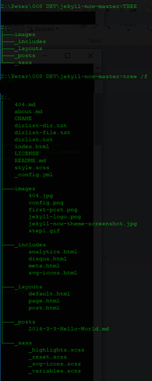

# William Koehrsen und Jeckill Now

[Jeckyll](https://jekyllrb.com) ist ein statischer Websitengenerator. D.h. eine "Maschine" die analog einem gedruckten Buch mit HTML und CSS Internetseiten erstellt. 2008 von Tom Preston-Werner - einem der Gründer von GitHub - [erfunden](https://en.wikipedia.org/wiki/Jekyll_(software)), ist es inzwischen einer der populärsten statischen Seitengeneratoren.  

William Koehrsen hat nun auf GitHub eine Vorlage ("Repository") namens ["Jeckyll Now"](https://github.com/barryclark/jekyll-now) erstellt, welche frei kopiert ("forken") weden darf. In diesem [Artikel](https://towardsdatascience.com/five-minutes-to-your-own-website-fd0b43cbd886) stellt er die Behauptung auf, dass man damit in fünf Minunten einen funktionieren Blog im Internet hat. D.h. man kann direkt anfangen mit Markdown Blogposts zu schreiben, welche ungefähr [so](http://www.jekyllnow.com) aussehen. Zum Beispiel mit Visual Studio Code, meinem bevorzugten Editor.  Daher sollte es klar sein, dass der Einsatz von "Jeckyll" mit GitHub gedacht ist. Man kann die Blogposts online erstellen bzw. editieren oder in einem lokalen Editor und einem abschliessenden Datenabgleich ("Sync") mit GitHub.  

Dieser Artikel schildert meine Erfahungen sowie mein Einstieg in Jeckyll bzw. "Jeckyll Now" mit diesem Blog. Weder bin ich Entwickler, noch Webdesigner. Ich habe in den vergangenen Jahrzehnten ein paar Stunden in HTML, CSS, JavaScript und ASP / ASP.Net investiert. Wenn technische Aussagen nicht korrekt oder nicht präzise sind, freue ich mich über ein Feedback. Korrektur asap. Der Artikel erklärt das Vorgehen genügend detailiert, so das jemand mit Browsern und Webservices vertraut ist, innert 15 Minuten am Ziel ist. Git, GitHub und Markdown sind keine komplexen System. Dokumentation bzw. Einführungen sind  auch in deutscher Sprache im Internet leicht auffindbar. Generell muss man Geduld haben, wenn man Design Änderungen macht. Anders als in statischem HTML, wo im Browser die geänderte Website sofort angezeigt wird, kann es über GitHub bis zu 14 Minuten gehen. Und falls man auf GitHub mehrere Projekte verwaltet, nie die Domain Zuordnung (.io) auf ein anderes Projekt legen. Mein diesbezüglicher "Test" ergab eine Offline Zeit von ca. 4 Stunden...  

Ein guter Einstieg ist die Datei "Readme.md". Dort wird erklärt (en), wie die Software funktioniert. Bzw. wo man den Blog konfigurieren kann. Dort wird u.a. auch auf diesen Artikel von ["Smashingmagazine"](https://www.smashingmagazine.com/2014/08/build-blog-jekyll-github-pages/) verwiesen.  

Die Anpassungen die hier dokumentiert werden, sind von unterschiedlicher Verständnistiefe. Ein kurzes nachschlagen auf [SelfHTML](https://wiki.selfhtml.org/wiki/Startseite) oder [W3Schools](https://www.w3schools.com) sollte fehlenden Wissen schnell aufbauen.  

Mit dem Befehl "Tree" der Windows Shell (CMD.EXE) ein kurzer Überblick wie die Datei und Verzeichnisstruktur aussieht.  

# Seitennamen, Beschreibung und Bild festlegen  

Die Konfiguration des Bloges erfolgt primär über die Datei "_config.yml" im Stammverzeichnis. Die englischen Kommentare sind leicht verständlich. Die ersten Zeilen meiner Datei sehen nach der Bearbeitung wie folgt aus:  

``
#
# This file contains configuration flags to customize your site
#

# Name of your site (displayed in the header)
name: Peter Gyger

# Short bio or description (displayed in the header)
description: IT Guy - Computer, Netzwerke und neue Technologien / Anwendungen... 

# URL of your avatar or profile pic (you could use your GitHub profile pic)
avatar: https://avatars3.githubusercontent.com/u/40018804?s=400&u=ad668957f4d7ff1468d52c3f5de201a72819ef43&v=4
``

# Hintergrundfarbe ändern
Wie leicht vorstellbar ist, wird für die Darstellung CSS verwendet. Im Stammverzeichnis hat es die CSS Datei: "style.scss". Der Anfang der Datei sieht so aus:  

--

//
// IMPORTS
//

@import "reset";
@import "variables";
// Syntax highlighting @import is at the bottom of this file

/**************/
/* BASE RULES */
/**************/

html {
  font-size: 100%;
}

body {
	background: $white;
  font: 18px/1.4 $helvetica;
  color: $darkGray;
}
``  
Die Eigenschaft "background:" im Element "body" muss auf die gewünschte Schriftfarbe angepasst werden. Für diesen Blog änderte ich die Zeile auf den Wert "#0f0a0a". Dazu findet man im Internet diverse Tools. Eine Möglichkeit ist, in der Googlesuche die Begriffe ["CSS Color Picker"](https://www.google.com/search?ei=Z4LbW4PYGZCXlwSXl66oCA&q=css+color+picker&oq=css+color+picker&gs_l=psy-ab.3..0l2j0i22i30k1l8.29730.36800.0.37190.8.6.0.2.2.0.211.835.1j4j1.6.0....0...1c.1.64.psy-ab..0.8.848...0i67k1j0i7i30k1.0.vLoQbsIlZdw) zu suchen. In der Googlesuche ist ein entsprechendes Gadget integriert.

# Schriftfarbe
Den Titel des Blogs ändert man in der Datei style.scss in dieser Sektion:  

``
.site-name {
  margin: 0;
  color: $darkgrey;
  cursor: pointer;
  font-family: $helveticaNeue;
  font-weight: 300;
  font-size: 28px;
  letter-spacing: 1px;
}
``
# Text ändern

"Read More" in einem Blog mit deutschen Artikeln ist nicht passend. Daher mit dem Worten "Mehr lesen" ersetzt.  
Dazu in der Datei "Index.html" die Zeile editieren. Nachher steht dort:  
``<a href="{{ site.baseurl }}{{ post.url }}" class="read-more">Mehr lesen</a>``

Wenn man die Farbe ändern will, kann man in der Datei Style.css die CSS Klasse "read more" einen Befehl dazu schreiben.  

Am Ende eines Posts steht "Written on". Auch das habe ich eingedeutsch. Neu steht dort "Letzte Änderung". Der Weg für über die Datei "post.html" im Verzeichnis "_layouts". Die Ausgangszeile lautet:  

``
    Written on {{ page.date | date: "%B %e, %Y" }}
``  

Aus meiner Sicht soll der Besucher des Blogs den geänderten Eintrag analog zu einem neuen Artikel zuoberst sehen. Wie man an der Codezeile oben sieht, wird das Datum aus dem Namen der Datei erstellt. Wenn ich diesen Automatismus nicht ersetzen will, muss ich also den Dateinamen der Datei auf das aktuelle Datum anpassen.  

Der Fairness geschuldet, update ich das Datum nur bei grösseren oder mehreren Änderungen. Der Leser soll ja keine aufgewärten Artikel wiederkäuen...  

