# TinyMedia Manager - Filme verwalten und mehr  

Jäger oder Sammler? Bzw. wieviel Sammler oder Jäger ist man? Musikalben, Bücher oder Filme sind Medien. Man nimmt eines in Besitz, nimmt sich Zeit dafür und legt es wieder weg. Oder doch nicht?  

## Filme verwalten?

Filme sind für viele Menschen minderwertiges Kulturgut. Nicht vergleichbar mit dem Kultstatus den Bücher haben. Man lümmelt sich auf dem Sofa und lässt sich vom TV bzw. Netflix berieseln. Nicht für mich, was meinem Naturell geschuldet ist, da ich selten etwas nebenher mache. Wie oft höre ich beim autofahren einen unbekannten Komponisten und wünschte mir, ein paar Hintergrundinformationen dazu. Last but not least stamme ich aus einer Generation, wo nur schon das lesen von nicht Schulbüchern zur Frage, ob alle Arbeiten erledigt sind, führte. D.h. Zeit "derdubeln" hat für mich noch immer einen kleinen, verboteten Reiz... 

Auf Grund der Digitalisierung hat man 2018 andere Probleme und andere Mittel zur Lösung. Das "Problem" ist u.a. die schiere Menge an Medien auf dem Markt. Rein um den Überblick zu behalten macht es Sinn, eine Liste zu führen. Es ist einfach ärgerlich, wenn man in den ersten 10 Minuten realisiert, dass man den Film bereits kennt. Der zweite Punkt ist, dass mit Computern und Internet Hintergrundinformationen zu Filmen - Herstellung, Schauspielern und Produzenten - findet. Und jede Sache, wirklich jede Sache in die man mit Leidenschaft und Hingabe Zeit investiert bereichert einem. Ja - man ist auf den meisten Gebieten mit Halbwissen und in seichten Gewässern unterwegs. Einfach weil die Zeit zu knapp ist und man Prioritäten setzen muss.  

Der [TinyMedia Manager](http://www.tinymediamanager.org) ist ein eine Software, die es mir ermöglicht mehr Spass mit Filmen zu haben. Einerseits direkt als Datenbank, wo mit Text und Bildern ein Film zu leben beginnt. Andererseits kann ich mit dieser Software NFO Dateien erstellen, welche anderen Programmen wie Kodi ("XBMC") als Informationsbasis dienen. Die Software ist für die drei grossen Betriebssyteme - Linux, MacOS und Windows verfügbar. Leider setzt sie die Java Runtime Umgebung voraus. .NET wäre mir rein von der Sicherheit und den Updatenintervallen näher gewesen. Versucht mit portable Java die "tmm.jar" auszuführen, waren nicht erfoglreich. Ja - ich habe vor Jahren andere Software angeschaut und habe meine Entscheidung für TinyMedia Manager nie revidiert. Natürlich habe ich dem Autor eine PayPal Spende zukommen lassen und konnte nachher die Vollversion freischalten. Eine Frage der Fairness, da bereits die kostenlose Variante in jeder Hinsicht ohne Einschränkung funktioniert.

## Installation

Die Installaton ist schnell gemacht. Eine Einstellung habe ich für Kodi angepasst. Auf Bild 3 sieht man, dass der Name der "nfo" Datei dem Filmnamen entsprechen soll. Natürlich liegen die Medien in einem Netzlaufwerk (Z:), wo alle Personen im Haushalt ("LAN") darauf Zugriff haben. In Bild Numer 6 sieht man unten rechts die Progressbar, die abhängig von Anzahl und verwendeter Technik (Hardware / Netzwerk) einige Zeit läuft. Die Installation in Bildern:  
1. 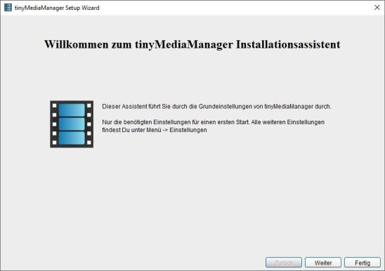
2. 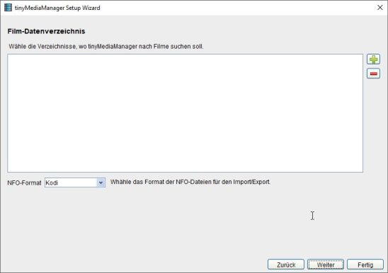
3. 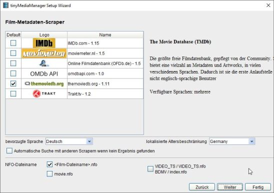
4. 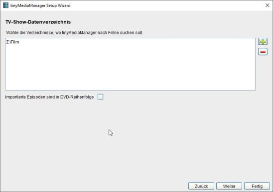
5. 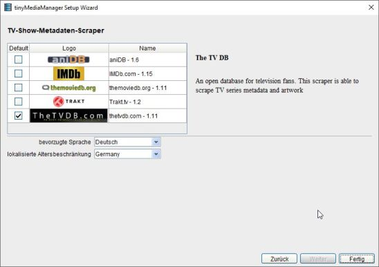
6. 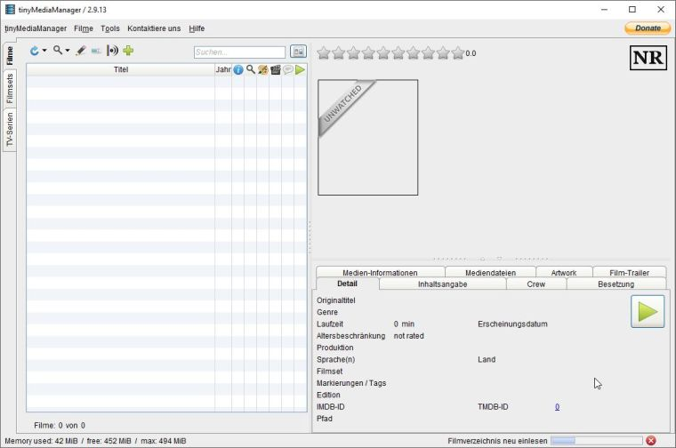

## Offline Medien hinzufügen

Ein wichtiger Punkt ist für mich, dass ich auch meine Filme auf Datenträgern katalogisieren kann.  Dafür habe ich ein eigenes Verzeichnis erstellt, was eine Frage des Modus Operandi ist. Für eine Medien Verwaltungssoftware spielt es keine Rolle.  

### Umsetzung

Im wesentlichen braucht es einen Ordner, der dem Filmnamen entspricht. Diesen ergänze ich mit der Jahreszahl, damit er eindeutiger wird. Im Ordner wird eine Textdatei erstellt. Der Name muss dem  Film bzw. dem Ordner entsprechen. Nach dem Namen füge ich einen Punkt und einen Verweis auf das Format (DVD / BR (BluRay / UBR ) ein. Die Erweiterung ist ".disc". Gross / Kleinschreibung oder Leerschläge werden von den mir bekannten Mediencentren wie Tiny nicht beachtet.    
Der Aufbau entspricht einer XML Datei mit einem Element "discstub". Darin hat es ein Elemnent "Message", das einen beliebigen Text enthalten kann. Z.B. ein Hinweis wo der Datenträger (DVD / BR ("Blu Ray") / UBR / etc. ) abgelegt ist.

```XML
  <discstub>
   <message>Regal 1 - linke Seite</message>
  </discstub>
```

Je sorgfältiger die Vorarbeit, desto weniger Ärger und Überraschungen hinterher. Das ist die Grundlage, aller meiner "How Tos" bzw. eines meiner Lebensweisheiten: "Improvisation ist der I-Punkt auf der Planung. Nicht umgekehrt".  

Ich gehe auf die Website einer Filmdatenbank. Z.B. ``www.themoviedb.org``. Dort stelle ich die Sprache auf DE mit Fallback EN ein, weil die Mehrheit meiner Datenträger deutsche Filmtitel hat. Für bekannte Filme wie "Zurück in die Zukunft" spielt das keine Rolle, da existiert ein Mapping. Es ist auch so, dass viele Filmtitel internation - sprich englisch - sind. Ausschlaggebend ist, dass der Ordner bzw. die [.disc] Datei einen Namen haben der in einer Filmdatenbank gefunden wird.  
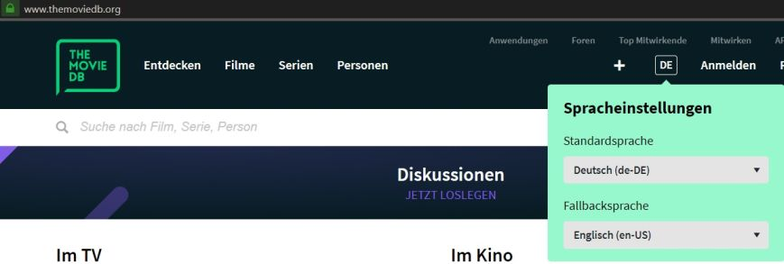.  

### Beispiel

Der Film "Cold War". Der Name wird gefunden und ein Klick auf den Film bestätigt das (Titelbild / Inhalt)
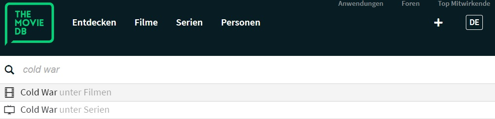
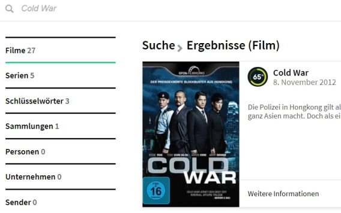

Das heisst ich habe ein Verzeichnis "Cold War 2012" erstellt. Darin befindet sich die Textdatei "cold_war2012.DVD.disc".  
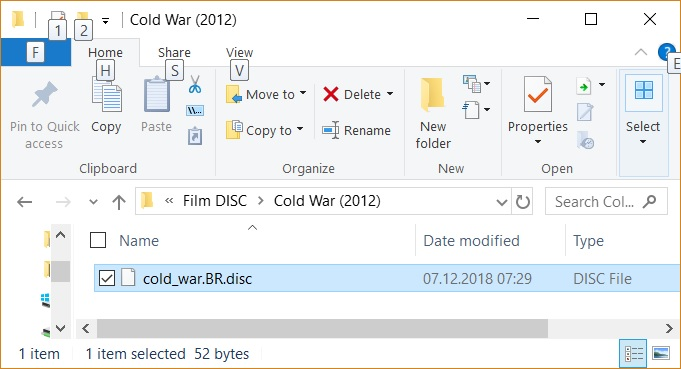

Danach dieselben Schritte wie für Filmdateien. Jetzt in TMM das Verzeichnis mit den Filmen neu einlesen. Der Film wird gefunden und erhält den Stempel "New".
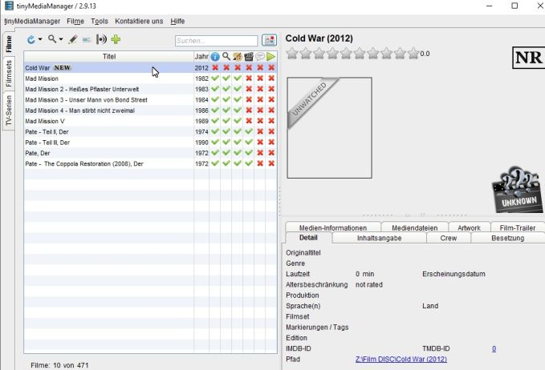 

Automatisch scrappen und alles erledigt
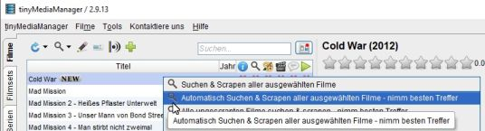
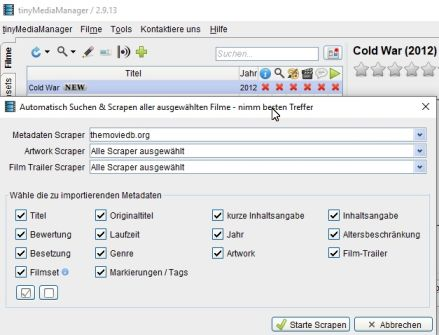
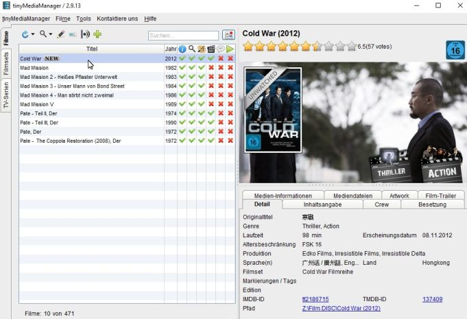 

Natürlich kratzt auch dieser Artikel nur an der Obefläche. Über TV Serien steht hier kein Wort. Bei Gelegenheit schreibe ich mehr dazu.  

## Powershell Skript

Man kann die zwei Punkte  
1. Verzeichnis erstellen
2. Datei in diesem Verzeichnis erstellen

mit einem Powershell Skript automatisieren. Z.B. wenn eine grössere Anzahl Datenträger erfasst werden soll. Im Verzeichnis wo die Unterverzeichnisse (pro Film ein Verzeichnis) erstellt werden, habe ich eine Vorlage ("vorlage.disc") erstellt. Der Text im Element "Message" ist schlicht "Kein Text", wenn keine Angaben benötigt sind.  

Ich kann dort auch vermerken, dass es ein 5 Disc Schuber wie z.B. bei der "The Dark Knight Triologie" ist. Jedoch ist diese Information von geringem Nutzen, da solche Metainformationen eher in der Mediensoftware wie TinyMediaManager ("Filmsets") oder Kodi ablege. Andererseits bezieht sich die Angabe nicht auf den Film, sondern auf einen bestimmten physikalischen Aspekt (Diskschuber, Anzahl BluRay darin, etc.). Da wird jeder Medienadmin sein Konzept entwickeln, dass für ihn passt.  

Über die Powershell CLI starte ich dieses Skript ("mkfilm.ps1") mit der Angabe des Namens des Films. Beispiel: ``.\mkfilm.ps1 "Reine Nervensache (1999)"``  Das Skript kopiert die die Datei Vorlage.disc in das neu erstellte Filmverzeichnis und benennt es analog zum Verzeichnisnamen. Da in diesem Beispiel nur BluRay Formate erfasst werden, habe ich den Präfix ".BR" in die Vorlage eingefügt. D.h. beim Beispiel oben, heisst die Textdatei im Verzeichnis "Reine Nervensache (1999).BR.disc".

Das Skript:  

<code></code><code>PowerShell
  # mkfilm.ps1
  # Filmverzeichnis für TinyMedia Manager erstellen

  # Eingabe verarbeiten
  param(
  [string]$dateiname)

  #Verzeichnis und Datei erstellen
  New-Item -Path "Z:\Film DISC" -Name $dateiname -ItemType directory
  Copy-Item "Z:\Film DISC\vorlage.disc" ("Z:\Film DISC\" + $dateiname)
  rename-item ("Z:\Film DISC\" + $dateiname + "\vorlage.disc") ($dateiname + ".BR" + ".disc")  
</code><code></code>


# Quellen

* [Kodi Wiki: NFO Files](https://kodi.wiki/view/NFO_files)
* [Kodi Wiki: NFO files/Movies](https://kodi.wiki/view/NFO_files/Movies)
* [Kodi Wiki: NFO files/TV shows](https://kodi.wiki/view/NFO_files/TV_shows)
* [Kodi Wiki: NFO files/Music videos](https://kodi.wiki/view/NFO_files/Music_videos)

