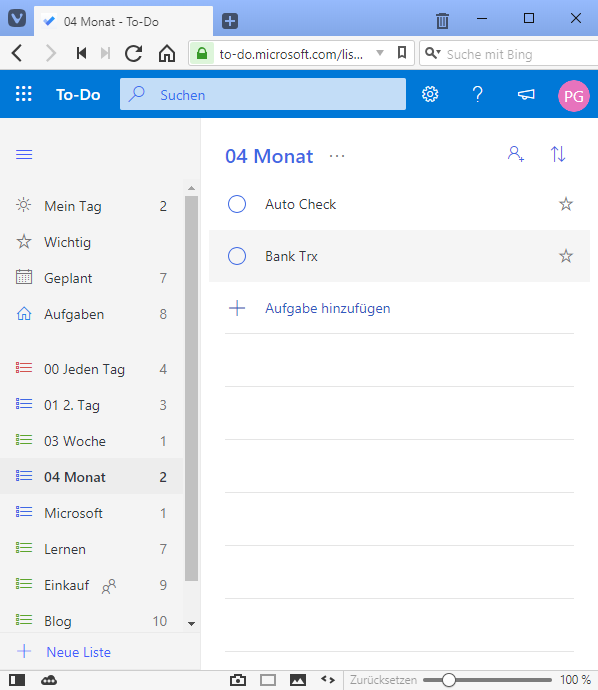

# Microsoft Sticky Notes und To-Do - steil nach oben

Microsoft hat mit MS Office eine "Cash Cow" am Start, die über viele Jahre Geld abwarf. Daher hatte Microsoft wenig Interesse, diese mit in Windows integrierten Tools zu konkurrenzieren. Ein trauriges Beispiel dafür sind die kostenlosen Viewer, die seit Jahren nicht mehr angeboten bzw. gepflegt werden.  
Microsoft hat mit "Sticky Notes" und "ToDo" zwei Apps bzw. Webservies am Start die sich 2018 enorm entwickelt haben. In Kombination mit meinem Android Handy nutze ich diese zwei Tools inzwischen täglich. Und das Zusammenspiel mit Windows und den integrierten Apps "Calendar" und "Mail" wird ebenso entwickelt.

## To-Do

Microsoft fing 2017 an, die eingekaufte App / Webservice "Wunderlist" durch eine eigene App zu ersetzen: ["To-Do"](https://products.office.com/de-CH/microsoft-to-do-list-app). Im Dezember 2018 ist diese Entwicklung so weit fortgeschritten, dass die beliebte App "Wunderlist" überholt wurde.  

### Website

In jedem Browser kann ich meine ToDos bearbeiten. Abhängig von der Sprache die im Browser eingestellt ist, steht z.B. "Aufgaben" oder "Tasks".  
  

### Windows App

### Android App

## Sticky Notes

### Website

### Windows App

### Android App

# Quellen

- [Microsoft ToDo](https://todo.microsoft.com/de-de/)
- [Twitter: MS To Do](https://twitter.com/MicrosoftToDo/status/1037012163825750016)
- [Microsoft To-Do Insider for Android](https://plus.google.com/communities/104352326256055408016)
- [Ein Microsoft To-Do-Insider werden](https://support.office.com/de-de/article/Ein-Microsoft-to-do-Insider-werden-445c380a-6dce-47e4-899d-1478a690b225)
- [MS Techcommunity To-Do](https://techcommunity.microsoft.com/t5/Microsoft-To-Do/ct-p/MicrosoftTo-Do)
- [MS Store: Microsoft To-Do: List, Task & Reminder](https://www.microsoft.com/de-ch/p/microsoft-to-do/9nblggh5r558?activetab=pivot:overviewtab)
- [MS Support: To-Do](https://todosupport.helpshift.com/a/microsoft-to-do/?p=web)