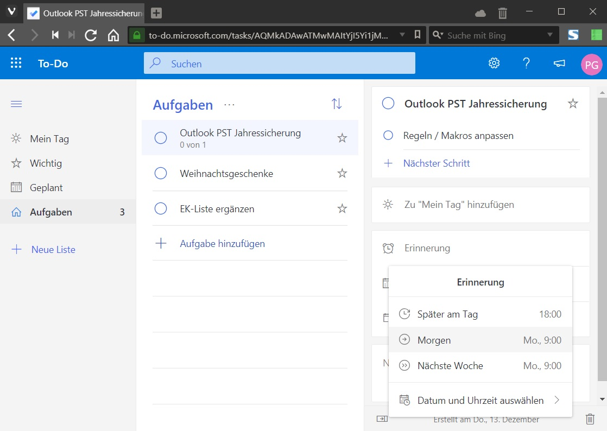
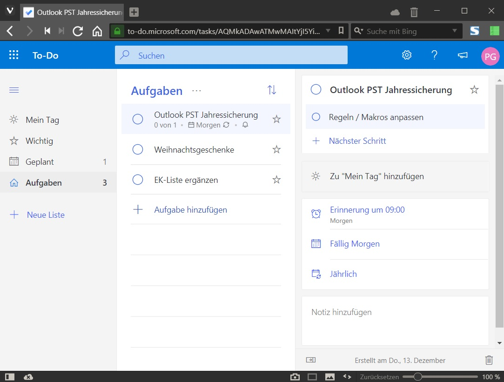
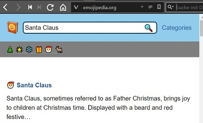
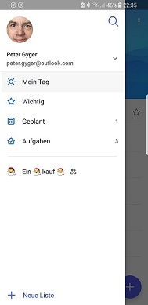
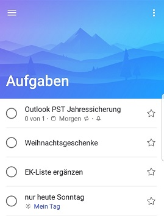

# Microsoft To-Do - steil nach oben

Microsoft hat mit MS Office eine "Cash Cow" am Start, die über viele Jahre Geld abwarf. Daher hatte Microsoft wenig Interesse, diese mit in Windows integrierten Tools zu konkurrenzieren. Ein trauriges Beispiel dafür sind die kostenlosen Viewer, die seit Jahren nicht mehr angeboten bzw. gepflegt werden.  
Microsoft hat mit "Sticky Notes" und "ToDo" zwei Apps bzw. Webservies am Start die sich 2018 enorm entwickelt haben. In Kombination mit meinem Android Handy nutze ich diese zwei Tools inzwischen täglich. Und das Zusammenspiel mit Windows und den integrierten Apps "Calendar" und "Mail" wird ebenso entwickelt.  
Natürlich ist der Vorteil der Datenaustausch über die Microsoft Server. D.h. in Sekunden sind die Daten auf allen Geräten - Android Handy, Webservice und Windows Desktop abgeglichen. Man kann den Microsoft Account mit der eigenen Domain (TLD) einrichten und ist nicht gezwungen über einen "Outlook.com" Account zu gehen.  

Die IOS App berücksichtige ich hier nicht, da mir kein Apple Gerät vorliegt.

## To-Do

Microsoft fing 2017 an, die eingekaufte App / Webservice "Wunderlist" durch eine eigene App zu ersetzen: ["To-Do"](https://products.office.com/de-CH/microsoft-to-do-list-app). Im Dezember 2018 ist diese Entwicklung so weit fortgeschritten, dass die beliebte App "Wunderlist" überholt wurde.  
Natürlich sind die Optionen nicht so umfangreich wie in Outlook. Nur stellt sich die Frage, wer dieses mehr an Optionen auch konsequent nutzt. Genauso wie MS Projekt, welches gegenüber einem MS Excel in Planung und Projekten keine Anwendungschance hat....

### Aufgaben

  
Der Menupunkt "Aufgaben" auf der linken Seite hat als Icon ein Haus. D.h. dieser Menupunkt ist die Basis. Anhand dreier Aufgaben die als Beispiel dienen, nachfolgend eine Übersicht was die Applikation für Möglichkeiten bietet. Die Aufgabenliste kann nach bestimmten Kriterien ("erledigt" / "Wichtigkeit" / "Fälligkeitsdatum" /etc.) sortiert werden. Danach kann ich nach Gutdünken  Kriterien eine Aufgabe weiter nach oben setzen ("Drag and Drop") oder mit den Peilen über den Aufgaben nach oben / unten verschieben.  

  
Nachdem eine Aufgabe markiert ist, sieht man rechts die Details die einstellen kann. Der Stern kennzeichnet die Aufgabe als "Wichtig". was konkret bedeutet, dass sie auf der linken Seite in der Rubrik "Wichtig" angezeigt wird. Ferner wird der Zähler des Menupunktes um eines erhöht, damit man weiss wieviele wichtige Aufgaben definiert wurden. Höhrere Priorität ohne weiter Granulierung. Der Kreis, um den Haken ("Tick") zu setzen, löscht die Aufgabe aus der Liste.  
  

Die englische Oberfläche ist selbsterklärend wie man nachfolgend sehen kann. Als erstes füge ich zur Aufgabe eine Teilaufgabe hinzu. Diesesmal mit der engschlisprachigen Version, um einen Eindruck zu vermitteln. 
  

"Zu "Mein Tag" hinzufügen (grüne Markierung), heisst das der Task an diesem Tag ("Heute") in der linken Leiste unter "Mein Tag" angezeigt wird. Nur "Heute", unabhängig ob die Aufgabe erledigt wird oder nicht. "Fälligkeitsdatum hinzufügen hat mehr Spielraum. Wenn ein solches gesetzt wird, wird es auch auf der linken Seite in der Rubrik "Geplant" angezeigt.
 
 

Auch wenn das aktuelle Datum mit einem Datum "Geplant" übereinstimmt, wird das nicht unter "Mein Tag" angezeigt. Wenn ein "Fälligkeitsdatum" festgelegt wird, wird das nur in der Rubrik "Aufgaben", in der Aufgabenliste angezeit. Nicht unter "Mein Tag". "Wiederholen" bietet die bekannten Optionen. Ich habe mir Listen für periodische Pendenzen angelegt:  
* "Täglich"
* "WTag"
* "Woche"
* "Monat"
* "HJahr"
* "Jahr"  

Auch hier diesselbe Anzeigeregel: Die aktivierte Wiederhol Option wird nur in der Aufgabe selber, bzw. den Details zur Aufgabe rechts angezeigt. Alle Optionen gelten für die gesamte Aufgabe. Für einen "Schritt" kann keine Option definiert werden.  
  

### "Mein Tag"  

Die Idee von "To-Do" ist, dass man den neuen Tag am Morgen plant. D.h. die Aufgaben hier einträgt, die man heute erledigen will. Etwas einfach gedacht, für meinen Geschmack. Und der Assistent namens "Vorschläge", der in der Windows App mit einer Glühbirne (Daniel Düsentrieb lässt grüsen) dargestellt ist, soll mir bei der Auswahl der Aufgaben helfen. Es kann sein, dass wenn ich einige Zeit mit einer KI verbringe, dass Sie in der Lage ist mich intelligent zu unterstützen. Meine Prioritäten und Schwächen / Stärken kennt. Aktuell ist das nicht der Fall, daher muss ich entscheiden, was wann erledigt wrid. 

### Listen ("Smart List")

"Wichtig" und "Geplant" sind Listen die bestimmte Aufgaben anzeigen. Die Anzeige dieser Listen lässt sich über Optionen auch deaktivieren. Unterhalb dieser Listen wird "+ Neue Liste" angezeigt, womit eigene Listen erstellt werden kann. Ein spezielles Feature ist, dass eine solche Liste mit anderen Teilnehmern geteilt werden kann. Wie das bereits aus Cloud Lösungen wie Outlook.com kennt. Angeblich soll man über den Papierkorb in Outlook.com auch gelöschte Listen wieder herstellen können. Das hat bei mir nicht geklappt. Trotz verschiedener Versuche und von 20 Minunten abwarten. In diesem Beispiel erstelle ich eine Liste "Einkauf" die ich mit meiner Partnerin teile.  

Klick mit der rechten Maustaste ("Kontextmenu") auf die erstellte Liste "Einkauf" ausführen.  Danach wird ein Link für den Zugriff erzeugt.
  
  
  

"Weitere Optionen" bietet an, das teilen der Liste zu beenden oder den Zugriff auf die aktuelle Mitglieder zu beschränken. Damit kann verhindert werden, dass jemand der in Besitz der URL gelangt, sich in die Gruppe "schmuggeln" kann.  

Wenn man diese URL z.B. in einem E-Mail anklickt, dann wird gefragt ob MS To-Do geöffnet werden darf, danach wird der Empfänger gefragt, ob er zustimmt die Liste "Einkauf" beizutreten.  
  

Wenn die angeschriebene Person beigetreten ist, sehen unsere To-Do Applikationen wie folgt aus. Links meine (Gastgeber) To-Do App im Browser und rechts der Gast mit seiner Windows To-Do App. 
  
Über das Gruppensymbol mit der Zahl 2 (aktueller Teilnehmerstand) kann ich die Teilnehmergruppe anssehen. Als Gastgeber mit den bereits besprochenen Optionen, als Teilnehmer mit der Möglichkeit die Gruppe zu verlassen.
  

#### Emoji

In der Windows App kann ich in einer Liste, über das Menu (...) eine Liste umbennen. Zusätzlich hat es links vom Namen einen Button, um am Anfang des Namens einen Emoji einzufügen.  
  

Im Browser geht das auch, jedoch indirekt. Dafür kann das Emoji an jeder Stelle bzw. Stellen verwenden. Die Emjis hole ich z.B. von der Website ["emojipedia.org"](https://emojipedia.org). Konkretes Beispiel sogleich.
  
  
In diesen Bildern sieht man eine mögliche Variante. Ich suche nach einem Begriff, klicke den ersten passenden Treffer an. In der nun angezeigten Webseite müsst es diesen Button "Copy" haben. Danach wechslen in den Browser mit der To-Do App, "umbennen" anklicken und das Emoji plazieren. Wo und so oft man will.  
  
Natürlich wird das korrekt und innert Sekunden auch in der Android App dargestellt  
  

Auch die Abbildung der Aufgabe in [Outlook](https://todosupport.helpshift.com/a/microsoft-to-do/?p=web&s=integrations&f=using-microsoft-to-do-with-outlook-tasks&l=de) (Office 365) funktioniert ohne Aufwand.  
  

Ebenso in [Outlook.com](https://todosupport.helpshift.com/a/microsoft-to-do/?p=web&s=integrations&f=using-microsoft-to-do-with-outlook-com&l=de)  
 

### Konfiguration und Titelleiste

 
Diese fünf Menupunkte sind:
1.  MS Cloud Apps ("Outlook.com")
2.  Suchen
3.  Konfiguration
4.  Links zu MS-Website mit Tipps und eine MS Website wo man weitere Funktionen (User Vocie) vorschlagen kann
5.  MS News zu der Applikation  

#### Suchen

"Suchen" findet nur Inhalt, welche im Kalender heute der früher vorkommen. D.h. bei diesen drei Beispielaufgaben hat die Suche keine Treffer angezeigt.  

#### Konfiguration

Der obere Teil spricht für sich  
  
Zum unteren Teil zwei Kommentare. "Sitzungs-ID kopieren" benötigt man dann, wenn man sich an den MS Support wendet und diese das Problem nachvollziehen wollen. "Ihren Inhalt exportieren" hat auf meinem Computer einen Fehler angezeigt. 
  

In jedem Browser kann ich meine ToDos bearbeiten. Abhängig von der Sprache die im Browser eingestellt ist, erfolgt die Anmeldung in einer der verfügbaren Sprachen. Wie gewohnt gibt es auch keine Browserabhängigkeiten mehr. Ich arbeite sowohl mit MS Edge wie mit Vivaldi und habe keinen Unterschied festgestellt. Ein Detail am Rande ist, dass man in Edge die Sprache nicht einstellen kann. D.h. Edge orientiert sich an dne Windowseinstellungen.  

### Windows App

Die App zeigt dieselben Funktionen wie im Browser an. Auch optisch ist kaun ein  Unterschied zu sehen. Nur das Einstellungsmenu ist im Profil des angemeldeten Benutzers hinterlegt.  

Nervig ist das Windows Design. Wenn man die Einstellungen öffnet, erkannt man nicht das nur ein Teil der Seite angezeigt wird. Auch die die Scrollbar ("Rollbalken") auf der rechten Seite ist ausgeblendet, bis man mit dem Cursor darüber fährt. Analog den auf Tablets und Design optimierten Websites wiedermal ein Beispiel das Schönheit vor Effizienz geht...  

### Android App

Dasselbe gilt für die Android App.  
  
Ich bin der Insider Gruppe - [Microsoft To-Do Insider for Android](https://plus.google.com/communities/104352326256055408016) - schon länger beigetreten und hatte mit meinem Samsung S8 noch keinen Ärger. Insgesamt eine stabile Betaversion. Aktuell ist die Version 1.46.7625 / Insider Build #7625 installiert. Was die App seit der Version 1.45 der Windows App voraus hat, ist die Multiuser Möglichkeit. D.h. ich kann in der App mehrere Accounts führen. Praktisch, wenn man verschiedene Lebensbereich strikt trennen will bzw. stärker fokusieren will oder schlicht die Übersicht bewahren will.  

### Windows 10 - Live Kachel

Unter Windows 10 wird die App als Live Kachel angezeigt. D.h. das die Aufgaben die ich für den heutigen Tag mir vorgenommen habe, jedesmal sehe, wenn ich das Windows Menu anklicke. Für mich ein echter Mehrwert.  
 

# Quellen

- [ZDNet: Microsoft's Notes and Tasks strategy explained](https://www.zdnet.com/article/microsofts-notes-and-tasks-strategy-explained/)
- [Microsoft To-Do](https://todo.microsoft.com/de-de/)
- [MS To-Do Support](https://todosupport.helpshift.com/a/microsoft-to-do/?p=web)
- [Microsoft To-Do-Hilfecenter](https://support.office.com/de-de/article/Microsoft-To-Do-Hilfecenter-1ea0750b-ebb1-4af0-932a-0006bd874b62)
- [Microsoft To-Do Uservoice](https://todo.uservoice.com/)
- [Microsoft To-Do Blog](https://techcommunity.microsoft.com/t5/Microsoft-To-Do-Blog/bg-p/To-DoBlog)
- [MS Techcommunity To-Do](https://techcommunity.microsoft.com/t5/Microsoft-To-Do/ct-p/MicrosoftTo-Do)
- [Twitter: MS To-Do](https://twitter.com/MicrosoftToDo/status/1037012163825750016)
- [Microsoft To-Do Insider for Android](https://plus.google.com/communities/104352326256055408016)
- [Ein Microsoft To-Do-Insider werden](https://support.office.com/de-de/article/Ein-Microsoft-to-do-Insider-werden-445c380a-6dce-47e4-899d-1478a690b225)
- [MS Store: Microsoft To-Do: List, Task & Reminder](https://www.microsoft.com/de-ch/p/microsoft-to-do/9nblggh5r558?activetab=pivot:overviewtab)
- [MS Support: To-Do](https://todosupport.helpshift.com/a/microsoft-to-do/?p=web)
- [Neowin: Microsoft will soon let you add lists and reminders in To-Do with Cortana](https://www.neowin.net/news/microsoft-will-soon-let-you-add-lists-and-reminders-in-to-do-with-cortana)