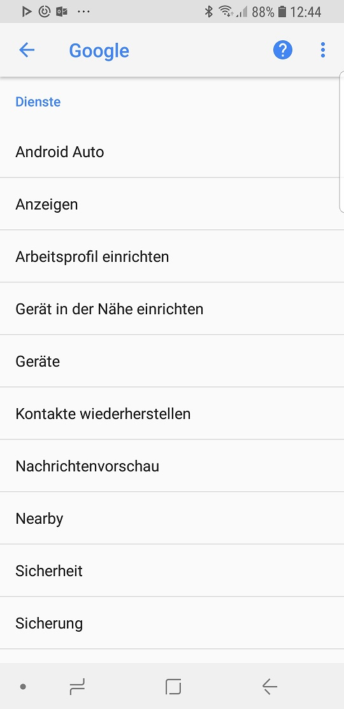

# Notizen zur Inbetriebnahme eines Samsung Galaxy S8  

In diesem Artikel geht es auch um Smartphone und der Inbetriebnahme des Android Betriebssystemes. Praktisch erarbeitet mit einem Samsung S8 mit Android 8 ("Oreo"). Diese Notizen beziehen sich ausschliesslich auf das Samsung S8 mit "Oreo". Natürlich wird einiges ganz allgmein auf andere Samsung Smartphones, bzw. Android Geräte zutreffen. Diese Notizen wurden direkt mit der Installation eines Samsung Galaxy S8 erstellt. Die Daten eines Samsung S5 wurden über die App "Smartswitch" und USB übertragen.  

Wenn ich ein neues Android Smartphone in Betrieb nehme, dann ist der erste grosse Schritt das man kein Google Konto ("überspringen") angibt oder anlegt. Wenn man sein Gerät nochmals neu und diesesmal ohne Google Account nutzen will, reicht ein Reset nicht aus. Die Firma Google blockiert die Nutzung des Gerätes. D.h. es muss wieder mit dem vorher genutzen Google Account in Betrieb genommen werden. Dieser [Diebstahlschutz](https://eu.community.samsung.com/t5/Community-Newsroom/Smartphone-nach-dem-Zur%C3%BCcksetzen-gesperrt-So-funktioniert-die/ba-p/639885) muss vorher deaktiviert werden. Erst danach kann der Reset mit neuer Installation erfolgen.  

## Meta

Erstellt:		26. Dezember 2018  
Modifiziert:	  

## Android

[Android](https://www.android.com/) verwenden, heisst seine Nutzungsdaten an Google abzugeben. Was für viele Benutzer ein relatives Problem ist, solange sie Apps wie WhatsApp oder Facebook installieren und verwenden. Diese Installaton steht unter dem Zeichen, etwas weniger Google als üblich auf dem Handy aktiv zu haben. Google und seine diversen Firmen sind mit Abstand der grösste Informationsbroker. Ein informativer Artikel dazu ist [Mike Kuketz: Tschüss Datenkrake: Ein Leben ohne Google](https://www.kuketz-blog.de/tschuess-datenkrake-ein-leben-ohne-google/). Daher sollte das grösste Datensilo nicht noch weiter mit Benutzerdaten gefüttert werden. Das Ziel ist also keine Nerd Lösung für einen Android Crack, sondern eine Kompromisslösung in Richtung goldene Mitte.  
Die grössten Sicherheitsprobleme gab es mit Open Source ("Heardbleed") und die [Updateprobleme](https://www.androidpure.com/android-one-os-update-support-duration/) diverser Embedded Linux Lösungen wie Android oder FreeNAS sprechen Bände. Eigentlich kann nur eine Firma, welche man über den Rechtsstaat belangen kann, eine Garantie für zeitnahe Updates und Fixes abgeben. Oder wer würde seine elektrischen Installation oder gar ein Auto von einer Studenten oder Hippiegruppe verbauen lassen?  

Ein Custom-ROM wie Lineage OS ist der Endpunkt, wenn man ein Android OS ohne Google will. Noch nicht mein Endziel hier und jetzt - nur kleine Schritte in die richtige Richtung. Und natürlich nur Open Source orientierte Services und Software. Das scheint mir aktuell zu viele Nachteile zu haben. Daher setze ich auf Microsoft Services. Der CEO "Satya Nadella" hat mir in den letzten Jahren am ehesten den Eindruck von Glaubwürdigkeit vermittelt. Seine vorbehaltlose Akzeptanz der DSVGO in einer Keynote, war nur eines der Beispiele.  

2018 sind MS Launcher, To-Do and Sticky Notes für mich unverzichtbar geworden. Das synchronisieren meiner Termine und Notizen über alle Android und Windows Geräte hinweg, hat mir vieles vereinfacht. Swisscom hat zwei kostenlose Cloudprodukte - DocSafe / MyCloud - am Start. Da die Daten in der Schweiz bleiben (?), ist das eine Alternative. Für mich sprechen mehrere Gründe dagegen, so das ich nach jahrelanger Erfahrung diese 2 Services in 2019 nicht mehr nutzen werde. "Nice try" kann ich nur sagen...  

Der Sprung auf [Android 9 ("Pie")](https://www.xda-developers.com/samsung-galaxy-s8-note-8-android-pie-one-ui-update-roadmap/) sollte im März 2019 erfolgen.  

### Oreo

#### Benachrichtigungskategorien

Die Ansätze der früheren Androidversionen die Benachrichtigungen pro App festzulegen sind jetzt umfassend abgeschlossen. 

### App Store

Wenn man keine Google ID verwenden will, muss man einen verstrauenswürdigen App Store finden. Das Installieren über APK Dateien ist aus vielen Gründen keine Lösung.Bekannte alternative App Stores sind zum Beispiel:  
- [Amazon App Store](www.amazon.de/androidapp)
- [F-Droid](https://f-droid.org)
- [Yalp - Zugriff auf den Playstore](https://f-droid.org/packages/com.github.yeriomin.yalpstore/)
- [Aurora - ein Fork von Yalp mit modernem GUI](https://f-droid.org/de/packages/com.dragons.aurora/)  

Amazon ist eine Alternative, wenn man ohnehin schon Kunde dort ist. [Futurezone.de ](<https://www.futurezone.de/apps/article213663935/Es-gibt-eine-sichere-Alternative-zum-Google-Play-Store.html?ref=sec>) hat einen kurzen Artikel zu F-Droid geschrieben. Die Anzahl Apps können nicht mit dem Google Playstore konkurrenzieren, aber sie ist beachtlich.

F-Droid aktualisiert analog dem Google Playstore die installierten Apps. Standardmässig alle 24h. Jedoch erlaubt Android aus Sicherheitsgründen nur Systemapps das automatische installieren. In F-Droid habe ich zusätzlich das [Repository](https://apt.izzysoft.de/fdroid/) von Andreas Itzchack einem bekannten Technik Journalisten eingebunden

Eine App lässt sich als APK Datei auch direkt installieren. D.h. die APK Datei downloaden und ausführen. Dadurch entfällt die Kontrolle des Storebetreibers, was man sich installiert. Ein zweischneidiges Schwert. Eine der als seriös geltenden Quellen für APK-Dateien ist die Website [APK Mirror](https://www.apkmirror.com). In der [FAQ](https://www.apkmirror.com/faq/) zu der Website wird iformiert, dass die APK Dateien auf schädliche Software geprüft wurde.  
Hinter der Website steht das Team von "Android Police", einer der ganz grossen Webportale zu Android. Auch das Forum XDA-Developer (das führende Forum für Entwickler von Apps) verweist regelmässig auf dieses Software Depository.  

Eine andere Variante ist, dass man sich auf einem nicht mehr genutzten Android Handy sich mit Google Account im Playstore anmeldet. Nach dem installieren der Apps ("APK Dateien") können diese Apps auf das eigene Handy kopiert werden. Nur sehr wenige Apps überprüfen, ob auf dem aktuellen Handy ein Google Konto eingerichtet ist.  

Dadurch das ich die Apps bereits auf einem anderen Android hatte, war keine Neuinstallation der Apps notwendig. Ein Problem zeigte sich mit der Twitter App. Diese wurde nach dem Start sofort wieder geschlossen ("Es ist ein Fehler aufgetreten"). Deinstalliert. Über den Amazone App Store versucht die App wieder zu installieren. Kein Erfolg. Neustart Smartphone. Kein Erfolg. Mich am Google Playstore angemeldet und die App erfolgreich installiert.

### Apps

Der Browser Vivaldi ist nicht für Android verfügbar. Daher habe ich den [DuckDuchGo Browser](https://duckduckgo.com/app) installiert.  
["NewPipe"](https://github.com/TeamNewPipe/NewPipe) ist eine Alternative für die YouTube App. Die App fetcht die Anfrage über Ihre Server zu Google und liefert die Antwort auf das Handy. 

Appliste:
1.  [DuckDuckGo Browser](https://duckduckgo.com/app)
2.  [NewPipe](https://github.com/TeamNewPipe/NewPipe)
3.  [HERE WeGo - über APK installieren](https://wego.here.com)
4.  [Threema](https://shop.threema.ch/download)
5.  [KeePass DX - Frontend für die KeePass DB](https://www.f-droid.org/en/packages/com.kunzisoft.keepass.libre/)
6.  [Transportr - ersetzt die SBB App](https://f-droid.org/repository/browse/?fdid=de.grobox.liberario)
7.  [Resilio](https://www.resilio.com/platforms/desktop/)
8.  [Open VPN](https://f-droid.org/en/packages/de.blinkt.openvpn/)  

## Ssmdung S8

Das Gehäuse hinterlässt sofort Fingerabdrücke. In jeder Farbe - schwarz am stärksten sichtbar.  "Always-on-Display" zeigt auf gesperrten Bildschirm differenziert diverse Informationen an. "Vollbild Apps": Unter "Einstellungen" -> "Anzeige" -> "Vollbild Apps" kann für jede App definiert werden, ob sie als Vollbild ausgeführt werden soll.  
Natürlich wird der Debugmodus nur in Ausnahmefällen eingeschaltet und danach sofort wieder deaktiviert. Und die SD verschlüsseln sollte genau so selbstverständlich sein, wie Bitlocker bzw. VeraCrypt oder die Haustüre abzuschliessen.  Die installiert Blotware wie Facebook wird deaktiviert, da es sich ohne Custom Rom oder rooten nicht deinstallieren lässt. Facebook kann ich ich auch über den Browser DuckDuckGo nutzen.  "Google Play Protect" wird deaktiviert.

**Biometrie**  
Biometrie ist kein Plus an Sicherheit, welche es rechtfertigt seine persönlichen Merkmale digital zu speichern. Aus Effizienzgründen z.B. mit "Windows Hello" oder dem [Microsoft Modern Keyboard mit Fingerabdruck-ID](https://www.microsoft.com/de-ch/p/microsoft-modern-keyboard-mit-fingerabdruck-id/) unter Windows 10 macht der Einsatz sicher Sinn. Ich war zu viele Jahre mit kritischen Daten unterwegs und habe mir betreffend Sicherheit jede Bequemlichkeit abgewöhnt. D.h. Pin (min 6 Stellen) oder Passwort und automatische Bildschirmsperre nach 1 Minute. 

**Kameratricks:**  
Doppeltes Drücken der Einschalttaste aktiviert die Kamera App.  
Doppeltes Drücken der Einschalttaste während die Kamera App gestartet ist, wechselt zwischen Selfie- und Hauptkamera.  
Auslösetaste ist ein Einhandzoom (links / rechts ziehen)  
Vorschaubild: Nach links wischen zeigt die Filteroptionen  
Vorschaubild: Nach rechts wischen zeigt zusätzliche Einstellungen  
"Animierte Gif" erstellen über "Smarte Select". Inhalt auf dem Bildschirm mit nach rechts wischen ("Smart Select" -> "Animation"). Die Funktion gibt es seit dem Note 7 und es hat im Web zahlreiche Anleitungen dazu.

**Bildschirm fotografieren:**  
Leiser und Einschalttaste ein paar Sekunden gedrückt halten, dann wird der Bilmschirm fotografiert.  
"Scrollaufnahme" - wenn der zu fotografierende Bildschirm überlappend ist, hat es in der Fussleiste die Möglichkeit einer "Scrollaufnahme". D.h. für jeden weiteren Teil des Bildschirms der Teil des Screenshots sein soll, nochmals auf "Scrollaufnahme" drücken. Rechts im Bildschirm wird die Vorschau auf die Grafikdatei angezeigt.  

**Bixby**  
"Bixby" ist seit einigen Wochen auch in Deutsch verfügbar. Da Samsung kein der grossen Big Data Silos aus den USA sind, sollte man sich den Einsatz der Sprachsteuerung überlegen. Sprachsteuerung ist für mich in 2019 ein wichtiges Thema. Etwas neues, unbekanntes das mir mehr Effizienz verspricht. Da ich beruflich in der Microsoftwelt verankert bin, wird es Cortana sein.  
Da ich Bixby nicht nutze, habe ich dem Bixby Button rechts unterhalb der Lautstärke eine andere Funktion zugeteilt. Solche Bixby Remapper findet man über den Store Aurora. Es kann sein, dass diese Remapper nach einem Samsung Update nicht mehr funktionieren. Bis der Entwickler des Remappers auch nachgezogen hat.  

**Einstellungen -> Google**

Hier ist auch jeder einzelne Eintrag zu überprüfen und ggf. auszuschalten.  
  

# Quellen

* [Samsung.com](https://www.samsung.com/global/galaxy/galaxy-s8/specs/)
* [GSMArena](https://www.android.com/phones/samsung-galaxy-s8/)
* [YT: Technikfaultier: Samsung Galaxy S8 einrichten und erster Eindruck](https://www.youtube.com/watch?v=onKkXv2oJX8)
* [Wikipedia Samsung Galaxy S8](https://en.wikipedia.org/wiki/Samsung_Galaxy_S8)
* [Gopal Yadavf: Best Google Play Store Alternatives](https://medium.com/pen-bold-kiln-press/best-google-play-store-alternatives-30c759de1c26)
* [Andreas Itzchak: F-Droid: Die Privatsphäre-freundliche Alternative zum Google Play Store](https://android.izzysoft.de/articles/named/fdroid-intro-1)
* [Android Security Bulletin](https://source.android.com/security/bulletin)
* [Andreas Itzchak: Inoffizielle (und unvollständige) Liste mit F-Droid Repositories](https://android.izzysoft.de/articles/named/list-of-fdroid-repos)
* [Giga.de: HERE Maps APK-Download](https://www.giga.de/apps/here-maps/)
* [Android Package Comparsion](https://github.com/opengapps/opengapps/wiki/Package-Comparison)
* [Android Diebstahlschutz](https://eu.community.samsung.com/t5/Community-Newsroom/Smartphone-nach-dem-Zur%C3%BCcksetzen-gesperrt-So-funktioniert-die/ba-p/639885)
* [MSPowerUser.com: How to replace Google Assistant with Cortana...](https://mspoweruser.com/replace-google-assistant-cortana-galaxy-s8-android-phones/)
* [Windowscentral.com: How I turned my Samsung Galaxy S8 into a Microsoft phone](https://www.windowscentral.com/samsung-galaxy-s8-microsoft-edition-everything-you-need-know)
* [WindowsCentral.com: What Windows users need to know about the Samsung Galaxy S8](https://www.windowscentral.com/windows-users-and-samsung-galaxy-s8)
* [GSMArene.com: Samsung Galaxy S8 uses two different camera sensors](https://www.gsmarena.com/samsung_galaxy_s8_uses_two_different_camera_sensors-news-24316.php)
* [Geek.com: Everything You Need to Know About the Samsung Galaxy S8](https://www.geek.com/tech/everything-you-need-to-know-about-the-samsung-galaxy-s8-1686665/) 
* [Iriserkennung aktivieren](https://www.samsung.com/ch/support/mobile-devices/galaxy-s8-und-s8-plus-wie-funktioniert-die-iriserkennung/)
* [Warum erhalte ich keine App-Benachrichtigungen, wenn ich Android Oreo OS nutze?](https://www.samsung.com/ch/support/mobile-devices/warum-erhalte-ich-keine-app-benachrichtigungen-wenn-ich-android-oreo-os-nutze/)
