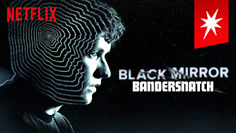
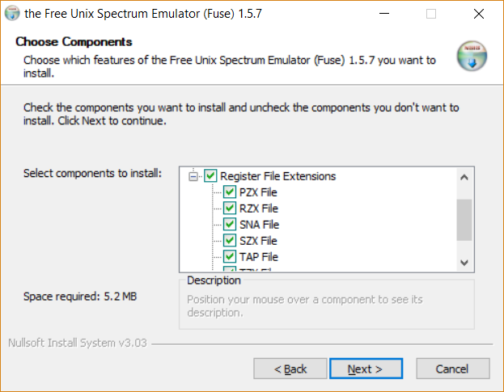

# Netflix: Black Mirror Bandersnatch (2018)  

[Bandersnatch](https://www.netflix.com/ch/title/80988062) ist ein aktuelles Experiment von Netflix. Die TV Serie "Black Mirror" soll den Spagat zwischen Computerspiel und (Smart-) TV schaffen. Das Spiel hat es tatsächlich gegeben und es wurde in [Computerzeitschriften](http://www.worldofspectrum.org/infoseekid.cgi?id=0009525) besprochen. Die Fangemeinde hat es verhalten positiv aufgenommen, weil die technische Umsetzung keine Meisterleistung war. Details im Bericht von [Moviepilot.de](https://www.moviepilot.de/news/black-mirror-bandersnatch-das-netflix-event-hat-ein-grosses-problem-1114979). Wer den Stern auf der rechten Seite nicht sieht, kann die interaktiven Feature nicht nutzen.  
  

Die Idee ist nicht neu. Zuletzt hat es Steven Soderberghs mit ["Mosaic"](http://www.filmstarts.de/nachrichten/18517217.html) versucht.  

Die TV Serie "Black Mirror" wurde ursprünglich auf der dem Sender ["Channel 4"](https://www.channel4.com) ausgestrahlt. Ab der 4. Staffel übernahm Netflix die Erstausstrahlung. "Bandersnatch" ist der Start in die 5. Staffel. Das Spiel ["Nohzdyve"](https://tuckersoft.net/ealing20541/nohzdyve/) das die Hauptrolle in diesem Film spielt, kann man downloaden. Netflix hat eigens für diese Folge eine Website (Homage an diese Folge sowie die Serie selber) eingerichtet und das Design entsprechend den 80er Jahren gestaltet. Warum es in den 80er Jahren noch keine solche Websiten geben konnte, ist jedem Informatiker oder an technischer Geschichte interessierten klar  ;-)  

Das Spiel wird als Tap-Datei auf den eigenen Datenträger geschrieben. Diese öffne ich normalerweise mit dem Emulator ["Eighty One"](https://www.aptanet.org/eightyone/). Diese Tap Datei konnte jedoch nicht dargestellt werden. Daher griff ich auf den universalen Emulator ["The Free Unix Spectrum Emulator (Fuse)"](http://fuse-emulator.sourceforge.net/) zurück. Wenn die Windows Software installiert wird, bitte einen Kontrollblick das unter "File Extensions" die Suffix ".TAP" den Haken hat. Sollte - da es "default" ist.  
.  

## Quellen

* [polygon.com:: Play Black Mirror: Bandersnatch’s video game in real life](https://www.polygon.com/2018/12/29/18160197/black-mirror-bandersnatch-video-game-zx-spectrum-emulator-nohzdyve)
* [The Reddit detectives are hard at work decoding Black Mirror: Bandersnatch](https://www.theverge.com/2018/12/28/18159516/black-mirror-bandersnatch-interactive-choice-maps-endings-easter-eggs-netflix-charlie-brooker)  * [Here are all the endings to netflixs bandersnatch](https://kakuchopurei.com/2018/12/29/here-are-all-the-endings-to-netflixs-bandersnatch/)  
* [Bandersnatch Mapped](https://imgur.com/Eoe1lo7)
* [Reddit: Bandersnatch Endings Thread](https://www.reddit.com/r/blackmirror/comments/aa98fs/bandersnatch_endings_thread/)
* [Reddit: What telephone numbers have you tried in Brandersnatch? Can we get a list going?](https://www.reddit.com/r/blackmirror/comments/aafows/what_telephone_numbers_have_you_tried_in/)
* [heise.de: Zeitmaschinen - Emulatoren für den Sinclair ZX Spectrum](https://www.heise.de/select/ct/2018/27/1541222468552219)
* [The Magnetic Scrolls Memorial presents: <Magnetic Scripts/>](https://www.msmemorial.de/msa2/msa2.html)
* [Software Emulatoren](http://www.worldofspectrum.org/emulators.html)

