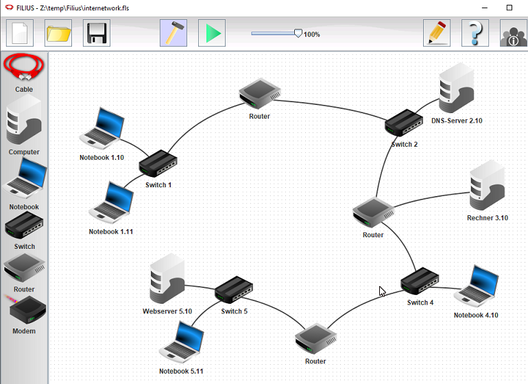

# Filius - Lernsoftware für IT Netzwerke

[Filius](http://www.lernsoftware-filius.de) ist eine clevere TCP/IP Netzwerksimulation, um die Grundlagen im Netzwerk spielerisch zu vertiefen. Die Programmierer dieser in Java entwickelten Simulation haben Ihre Idee wie folgt formuliert:  

> »FILIUS ist eine explorative Lernsoftware zum Thema Internetworking. Sie
> dient dem Erlernen von Grundwissen zum Internets und steht jedem frei zur
> Verfügung, der sich mit dem Thema Internet näher befassen möchte, ist
> aber insbesondere für den Einsatz in Schulen gedacht. Die Absicht der
> Entwickler dieser Software ist es, möglichst viele Nutzer zu gewinnen. 

Dr. Stefan Freischlad der dieses Programm an der Uni Siegen betreut, hat mir auf eine Anfrage über das [Kontaktformular](http://www.lernsoftware-filius.de/Kontakt) auf der Website innert eines (1!) Tages geantwortet. Ich denke, dass zeigt eindrücklich wieviel Herzblut dahinter steckt. So eine Software hätte ich mir in den 90er Jahren gewünscht, als ich an der Digicomp AG ("Willi Vollenweider") Kurse im Bereich Betriebssyteme und Netzwerke gegeben habe.

# Start

Die [Einführung](http://www.lernsoftware-filius.de/downloads/Einfuehrung_Filius_2015.pdf) umfasst 30 Seiten. Ist also schnell gelesen. Wie sich das für ein didaktisches Medium gehört, geht es ab Seite 9 mit den Kontrollaufgaben los. Nach diesen 30 Seiten weiss man was ein DHCP bzw. DNS Server ist, wie die Geräte in einem Netzwerk über die IP Adresse informationen erhalten und andere Grundlagen.  

# Weiter

Von der Webseite, genauer unter "Begleitmaterial" kann die Beispieldatei "internetwork.fls" in das lokale Netzwerk kopiert werden. Wenn man diese in Filius öffnet (gelbes Ordnersymbol in der Toolbar), dann sieht man im Sinne einer Demo eine typische Heiminstallation mit Internetzugang:  
  

Darunter wird die Option geboten, die Datei "Beispieldateien_Filius.zip" downzuloaden. Diese beinhaltet 3 Filius Dateien:  
1. bsp_dns_server.fls
2. bsp_e_mail.fls
3. musterloesung.fls  

Diese demonstrieren die Antwort zu den Aufgaben der PDF Datei "Beispielaufgaben_Filius.pdf".  

t.b.c. - asap

# Eigene Spielereien

Denksport Aufgabe 1:  
Können 2 Computer (Betriebssystem ist hierbei sekundär: aktuelles Linux, Windows oder MacOS) mit nur mit Ethernetkarte ausgestatted über ein Netzwerkkabel direkt Daten austauschen? Weshalb geht es oder geht es nicht? Oder muss noch etwas konfiguriert werden?  

Denksport Aufgabe 2:

# Quellen

* [Download Filius](http://www.lernsoftware-filius.de/Herunterladen)
* [Handbuch](http://www.lernsoftware-filius.de/Begleitmaterial)
* [Musterlösungen zu den Beispielaufgaben](http://www.lernsoftware-filius.de/downloads/Filius_Beispiele_Skript_2015.zip)