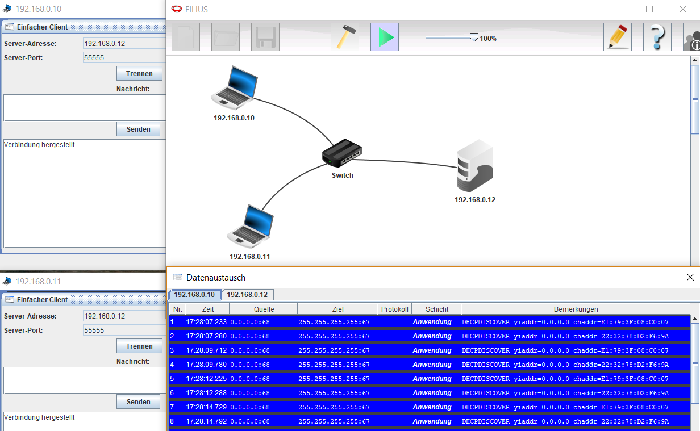

# Filius - Lernsoftware für IT Netzwerke

[Filius](http://www.lernsoftware-filius.de) ist eine clevere TCP/IP V4 Netzwerksimulation, um die Grundlagen im Netzwerk spielerisch zu vertiefen. Die Programmierer dieser in Java entwickelten Simulation haben Ihre Idee wie folgt formuliert:  

> »FILIUS ist eine explorative Lernsoftware zum Thema Internetworking. Sie
> dient dem Erlernen von Grundwissen zum Internets und steht jedem frei zur
> Verfügung, der sich mit dem Thema Internet näher befassen möchte, ist
> aber insbesondere für den Einsatz in Schulen gedacht. Die Absicht der
> Entwickler dieser Software ist es, möglichst viele Nutzer zu gewinnen. 

Dr. Stefan Freischlad der dieses Programm an der Uni Siegen betreut, hat mir auf eine Anfrage über das [Kontaktformular](http://www.lernsoftware-filius.de/Kontakt) auf der Website innert eines (1!) Tages geantwortet. Ich denke, dass zeigt eindrücklich wieviel Herzblut dahinter steckt. So eine Software hätte ich mir in den 90er Jahren gewünscht, als ich an der Digicomp AG ("Willi Vollenweider") Kurse im Bereich Betriebssyteme und Netzwerke gegeben habe.

Bekanntlich sind Netzwerke in Schichten aufgebaut. Das OSI Modell hat 7 Schichten und TCP-IP kennt 5. Inoffiziell reden wir Netzwerkler gerne auch von Schicht Null (Kabel / Netzwerkkarten / etc.) und Schicht 8 dem Nutzer. Filius denkt in den Kategorien von TCP-IP. D.h. OSI Schicht 3 bis 7 ohne den "Physical Layer" (Bitübertragung) und "Data Link Layer" (Fehlercheck).  

# Start

Die [Einführung](http://www.lernsoftware-filius.de/downloads/Einfuehrung_Filius_2015.pdf) umfasst 30 Seiten. Ist also schnell gelesen. Wie sich das für ein didaktisches Medium gehört, geht es ab Seite 9 mit den Kontrollaufgaben los. Nach diesen 30 Seiten weiss man was ein DHCP bzw. DNS Server ist, wie die Geräte in einem Netzwerk über die IP Adresse informationen erhalten und andere Grundlagen.  

# Weiter

Von der Webseite, genauer unter "Begleitmaterial" kann die Beispieldatei "internetwork.fls" in das lokale Netzwerk kopiert werden. Wenn man diese in Filius öffnet (gelbes Ordnersymbol in der Toolbar), dann sieht man im Sinne einer Demo eine typische Heiminstallation mit Internetzugang:  
  

Darunter wird die Option geboten, die Datei "Beispieldateien_Filius.zip" downzuloaden. Diese beinhaltet 3 Filius Dateien:  
1. bsp_dns_server.fls
2. bsp_e_mail.fls
3. musterloesung.fls  

Diese demonstrieren die Antwort zu den Aufgaben der PDF Datei "Beispielaufgaben_Filius.pdf".  

Die Aufgabe 4 führt zu folgendem Bild. Für die Beispiele aktiviere ich für die Geräte die Option, die IP Adresse als Namen zu verwenden. Das Datenaustauschfenster ist über den Rechtsklick mit der Maus auf die Notebooks oder Server erreichbar. Im Datenaustauschfenster sieht man für jeden Client ein Register ("Tab").  

  

Wer das Thema unterrichtet, sollte auf die Frage warum der Switch keine IP Adresse hat, eine verständliche Antwort haben. Für den Einsteiger ist das ein Widerspruch, da doch jedes Gerät im Netz eine IP Adresse hat und darüber am Datenverkehr teilnimmt.  

# Eigene Spielereien

*Denksport Aufgabe 1:*  
Können 2 Computer (Betriebssystem ist hierbei sekundär: aktuelles Linux, Windows oder MacOS orginal konfiguriert) mit nur mit Ethernetkarte ausgestatted über ein Netzwerkkabel direkt Daten austauschen? Weshalb geht es oder geht es nicht? Oder muss noch etwas konfiguriert werden?  

*Denksport Aufgabe 1 Antwort*  
Der TCP IP Stack (Software) ist auf DHCP Modus eingestellt. Wenn kein DHCP Server antwortet, vergibt er sich selber eine IP Adresse aus einem dafür reservierten Bereich. Das nennt sich APIPA oder "Zero Configuration". Details siehe dieser Artikel auf [itwissen.info](https://www.itwissen.info/APIPA-automatic-private-IP-addressing-Auto-IP-Protokoll.html).  
D.h. das diese zwei Computer ohne weitere Geräte über TCP IP (Browser, etc.) Daten austauschen können da sie im gleichen Adressbereich sind. Und das beide Geräte die gleiche IP ziehen ist bei einer Netzwerkklasse B sehr unwahrscheinlich.  

Mit Filius lässt sich das nicht nachspielen. Jeder Computer der hinzugefügt wird, erhält die IP Adresse "192.168.0.10". APIPA ist nicht aktiv in dieser Simulation. Auch nicht wenn ich in die Konfiguration des Gerätes gehe und "DHCP zur Konfiguration verwenden" anwähle. Die Augaben 1 und 2a im Handbuch demonstrieren dieses Netz mit einer manuell gesetzten IP Adresse.   

t.b.c. - asap  

# Quellen

* [Download Filius](http://www.lernsoftware-filius.de/Herunterladen)
* [Handbuch](http://www.lernsoftware-filius.de/Begleitmaterial)
* [Musterlösungen zu den Beispielaufgaben](http://www.lernsoftware-filius.de/downloads/Filius_Beispiele_Skript_2015.zip)