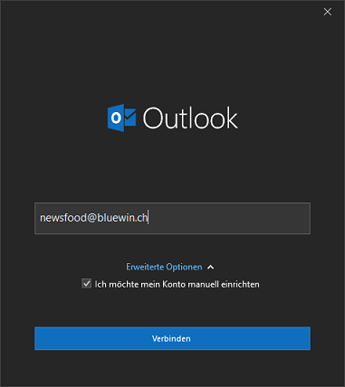
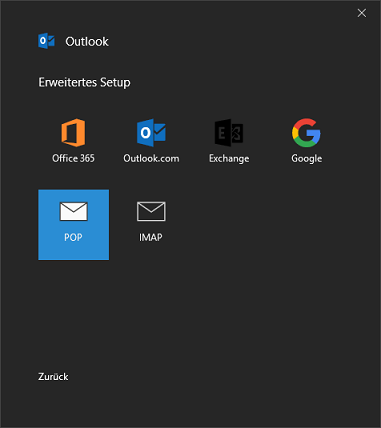
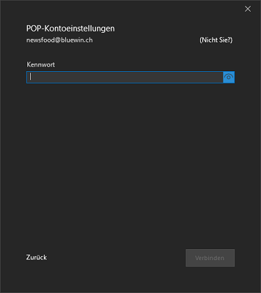
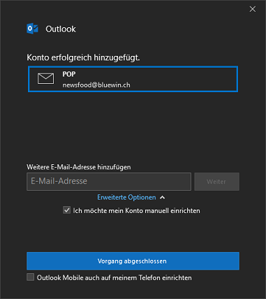
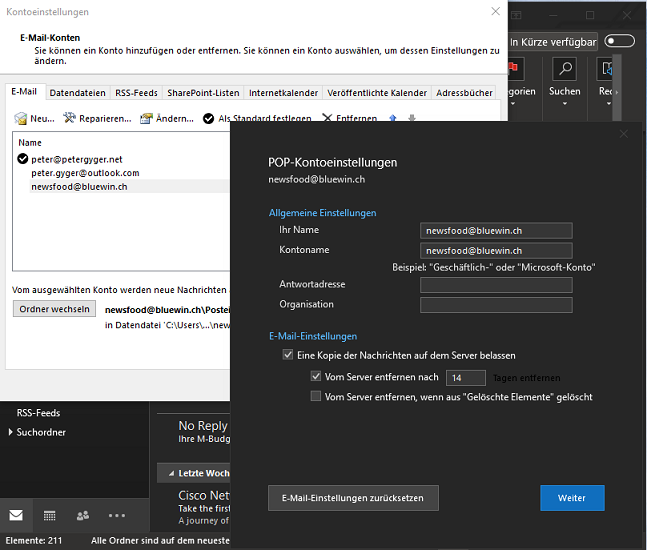
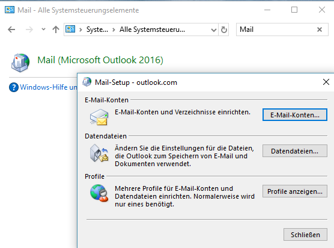
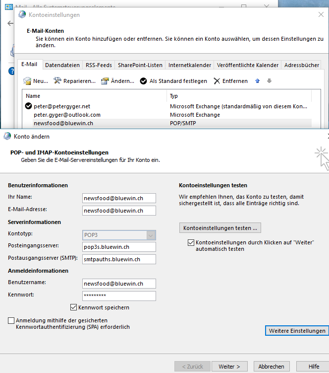
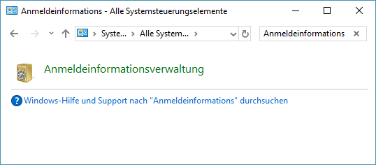
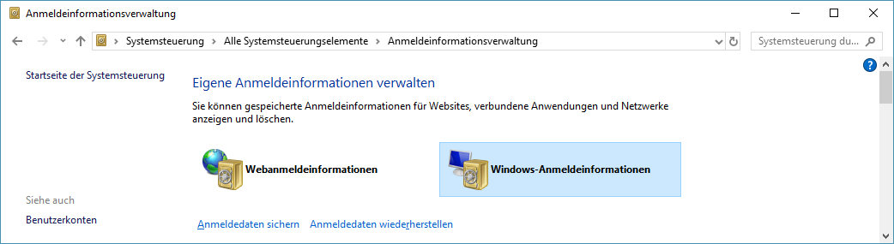

# MS Outlook: Passwort in Outlook nicht speichern

Wenn man in Outlook 2016 / 19 eine E-Mail Adresse konfiguriert, ist das sehr einfach. Das Programm ist weitgehend selbständig in der Lage, die notwendigen Angaben einzutragen. D.h. wenn man keinen Server mit ActiveSync Protokoll (Outlook.com) nutzt, sondern z.B. eine E-Mail Adresse wie "teddybaer@bluewn.ch" dann hat man Wahl zwischen "IMAP(S)" oder "POP(S)" und "SMTP(S)". Das sieht dann so aus:  

  
  
  
  

So weit so gut. Zwei Punkte muss man dabei jedoch wissen. Diese Punkte betreffend die "Sicherheit"

## Passwort für die PST Datei

Seit vielen Jahren nutzen viele Anwender zwei Funktionen, um den Zugriff auf die Daten zu verhindern. "Daten" sind nicht alleine E-Mails, da Outlook ein "Personal Information Management" Programm ist. D.h. auch Kontakte und Kalenderdaten dabei sind. Diese zwei Funktionen sind:  

1. PST Datei ist mit einem Kennwort gesichert, welches beim starten eingegeben werden muss
2. Das Passwort für den E-Mail Verkehr (Mails abholen / senden) wird jedesmal manuell eingeben.  

Ab Outlook 2013 hat Microsoft das neue Format ".OST" als Nachfolger der ".PST" Dateien favorisiert. D.h. wenn man nicht POP als Protokoll auswählt, wird Outlook eine OST Datei erstellen. Ein OST Datenspeicher kann nicht mit einem Passwort geschützt werden. Natürlich kann man argumentieren, dass das nicht entscheidend ist. Andere Faktoren wie SSL Protokolle (POPS / IMAPS / SMTPS) oder Festplattenverschlüsselung sowie ein regelmässig gewechseltes Windowspasswort tragen mehr zur Sicherheit bei.  
Für viele Anwender ist (war) dieses PST Passwort eine idealer Schutz der persönlichen Daten gegenüber dem Support oder Familienadmiistrator. Fakt ist, dass PST Dateien ein Relikt aus der Vergangenheit sind. Sie können für das lokale (auf dem Computer) speichern von Kontakten und Kalenderdaten verwendet werden.  

## Passwort für den Mailverkehr (abholen / senden) nicht speichern

Wenn eine E-Mailadresse in Outlook eingerichtet wird, dann muss das Passwort angegeben werden. Outlok speichert das , ohne Möglichkeit das nachträglich zu löschen.  
  

Man muss über die "Systemsteuerung", Menupunkt "Mail (Outlook 2016) gehen. Die Menumaske sieht auf den ersten Blick identisch aus. Dahinter sieht es jedoch "klassisch" aus, so wie man es seit vielen Jahren kennt.  
  
  

Wenn sich hier der gleiche minimale Dialog wie in Outlook öffnet, hat Windows 10 die Anmeldedaten in "Anmeldeinformationsverwaltung" ("Credential Manager") gespeichert. Dort in der Sektion "Windows-Anmeldeinformationen" die E-Mail Adresse suchen und löschen.  
  
  

## Quellen

- [MS: Mein Kalender und meine Kontakte können nicht mit meinem Smartphone oder Tablet synchronisiert werden](https://support.office.com/de-de/article/mein-kalender-und-meine-kontakte-können-nicht-mit-meinem-smartphone-oder-tablet-synchronisiert-werden-8479d764-b9f5-4fff-ba88-edd7c265df9f
)
- [Storageprovider für MAPI](https://www.msxfaq.de/exchange/clients/storage.htm)
- [Don’t risk losing your Contacts and Calendar when using IMAP in Outlook 2013, 2016, 2019, or Office 365](https://www.msoutlook.info/question/do-not-risk-losing-your-contacts-and-calendar-when-using-imap)