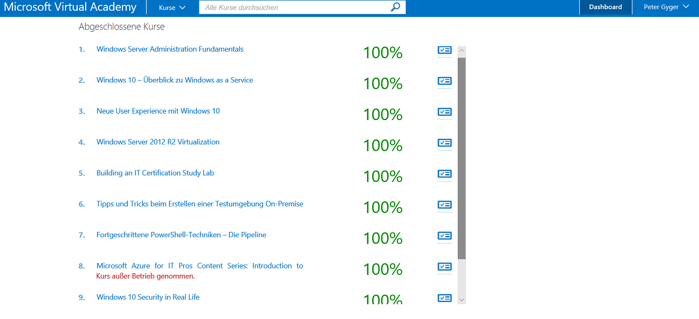

# Ade Microsoft Virtual Academy (MVA)

Eine der positiven Seiten des Internets sind die vielfältigen Bildungsangebote. Vieles ist für wenig oder gar kein Geld.

## Meta

Erstellt:		31. Januar 2019  
Modifiziert:	 

Die Microsoft Virtual Academy schliesst heute am 31. Januar 2019 schrittweise die Tore. Im Juni 2019 wird die Seite endgültig geschlossen werden. Die Kurse werden nicht übernommen. Zumindest wurde nichts diesbezüglich kommuniziert: 

>Zur Vereinfachung unserer Schulungsverfahren konsolidieren wir unsere diesbezüglichen Ressourcen und beenden die Microsoft Virtual Academy schrittweise ab 31. Januar 2019. Die vollständige Einstellung der Website ist für einen späteren Zeitpunkt 2019 vorgesehen. Sehen Sie öfters auf Ihrem MVA Dashboard nach, welche der von Ihnen begonnenen Kurse nicht mehr länger angeboten werden. Abschlussbescheinigungen werden nur für Kurse ausgestellt, die bis zum 31. Januar 2019 abgeschlossen sind.

Das wird auch der Grund sein, dass die  Teilnehmer wiederholt erinnert wurden, angefangene Kurse noch zu beenden. Bzw. die Zertifikate downzuloaden. Die neue Lern Plattform heisst ["Microsoft Lean"](https://docs.microsoft.com/en-us/learn/). Heute Morgen den 31. Januar ergab, dass  bereits einige Kurse nicht mehr verfügbar sind. Das wird die ärgern, die glauben zu bestimmen was es bedeutet, wenn etwas am 31. Januar ausgeschalten wird. Z.B. der Wechsel des Internetanschlusses. Der Kunde geht davon aus, es wird um 23:59 Uhr des letzten Tages ausgeschalten. Einerseits spielen da technische Aspekte hinein, andererseits Aufwände und last but not least Desinteresse. Hier ist es in jedemfall so, dass heute Morgen um 7 Uhr die ersten Kurse inaktiv sind. Andere wie "Azure Netzwerk Grundlagen" lassen sich nicht abspielen. In drei Browsern auf zwei Win 10 Computern reproduzierbar. Einige der Kurse bietet die den Doadnload der Videos und Whitepapers an. Manchmal nur mit der kleinsten Auflösung von 360p. Versuch macht klug - denn es wird nicht angegeben was für Optionen gegeben sind. Auch das [Forum](https://trainingsupport.microsoft.com/en-us/tcmva/forum/tcmvaserver?sort=LastReplyDate&dir=Desc&tab=All&status=all&mod=&modAge=&advFil=&postedAfter=&postedBefore=&threadType=all&isFilterExpanded=false&page=1) ("Community") kann man querbeet überfliegen und Informationen mitnehmen.       
  

  

Für mich schwingt da auch ein wenig Wehmut mit, da ich seit den Anfangstagen das Angebot genutzt habe. Sowohl als Kursleiter in der Digicomp AG (CEO Willi Vollenweider) wo wir auf Anfrage kostenlos Kurse besuchen konnten oder dieses MVA Angebot war für mich in meinem Fachgebiet - Windows, Netzwerke und Microsoft Produkte - ein Paradies. Die Nutzung war anders als Heute "just for fun". D.h. es gab Umbauten seintes MVA oder man verwendete die ursprüngliche Adresse nicht mehr. Das war mein zweitletzter Account mit der "outlook.com" E-Mail Adresse.
  

Abgelöst als ich meine Microsoft Geschichten über meine TLD "petergyger.net" aufgleiste. Über das Dashboard kann man sich die Certifikate (rechts von der 100% Angabe - blaues Icon) downloaden und die Liste über den Button "Transkript downloaden" in Dateiform speichern. Ev. macht man ja damit, einen Manager oder HR Mitarbeiter glücklich.
  

Die [EDX](https://www.edx.org/school/microsoft) Website mit englischen MOOC bleibt vorderhand nicht betroffen von dieser Änderung. Genauso wie auf YouTube der Channel ["Microsoft Video Courses
"](https://www.youtube.com/channel/UCJ31x5A6zIdHF5tJhjftyiA).

