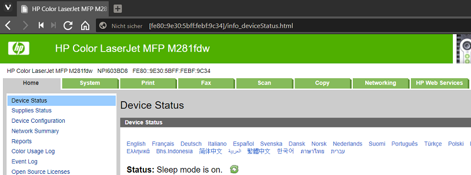
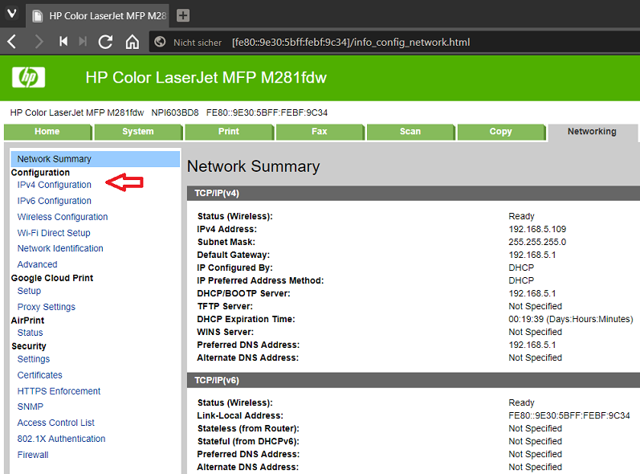

# HP Color LaserJet MFP M281fdw

Erfahrungen, Informatonen und Konfiguration sind hier gesammelt.  

# Netzwerk

## IP Konfiguration

### IPv4

Im LAN vor Ort wird ein "C" IP Adressbereich (254 Netzwerkadressen) aus dem für Private reservierten Bereich ([RFC1918](https://tools.ietf.org/html/rfc1918))eingesetzt. Der Adressbereich ist unterteilt in einen statischen und einen DHCP Bereich. Der DHCP Server (im Router integriert) verwendet den Adressbereich von ...100 bis ...240. Die Geräte mit statischer IP werden von ...1 bis ... 50 gesetzt. Genauer:  
- Netzwerk Hardware wie Router, Server, etc. von ...1 bis ...10
- Netzwerk Consumer Hardware die Drucker, NAS, etc. von ...11 bis ...20
- IoT Geräte (Webcam, Kaffemaschine, etc.) von ...21 bis ...40  

Der Drucker erhält die IP **192.168.5.14**. Das ganze kann bequem über das Netzwerk konfiguriert werden. Es ist notwendig vor dem Drucker zu stehen und sich durch das UI (User Interface) zu touchen. Das Gerät ist nach dem einstecken und einschalten auf DHCP Modus. D.h. man kann anschliessend die dynamische IP Adresse des Druckers ermitteln und über den Browser konfigurieren. Nachfolgend die notwendigen Schritte.  

[  

Wechsel zum Register ("Tab") "Networking. Linke Seite auf Menupunkt "IPv4 Configuration klicken.  
[  

Dort die Parameter einstellen aund abschliessend auf "Apply" klicken:  
- "IP Preferred Address Method"
- "IP Address"
- "Default Gateway"

Die IP Adresse ergibt sich aus dem oben besprochenen IP Adressplan. Der "Default Gateway" ist i.d.R. der Router, der den Interzugang gewährleistet.  

[  

# Quellen
* [HP Produktseite: HP Color LaserJet Pro-MFP M281fdw](https://www8.hp.com/ch/de/products/printers/product-detail.html?oid=14142597#!tab=features)
* [HP Kundensupport: HP Color LaserJet Pro MFP M281fdw](https://support.hp.com/de-de/product/HP-Color-LaserJet-Pro-M280-M281-Multifunction-Printer-series/14142489/model/14142491)
* [HP Forum](https://h30492.www3.hp.com/t5/forums/searchpage/tab/message?advanced=false&allow_punctuation=false&q=LaserJet+Pro+MFP+M281)
* [Linux (Fedora) Installation](https://forums.fedoraforum.org/showthread.php?317915-Print-amp-scan-with-an-HP-Color-LaserJet-MFP-M281-(fdw)&p=1806395)
