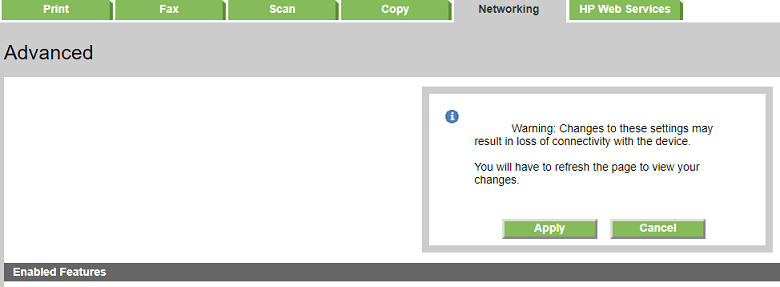

# HP Color LaserJet MFP M281fdw

Erfahrungen, Informatonen und Konfiguration sind hier gesammelt.  

Der HP Color LaserJet MFP M281fw ist ein Multifunktionsdrucker. Durch seine platzsparende Bauweise ist er für kleine Räume oder Geschäfte geeignet. HP Produkte ist in den letzten Jahren meine bevorzugte Wahl, weil die Qualität der Produkte und des Services mich mehr überzeugen als bei den MIttbewerbern.  

Die Sprache der Oberfläche lasse ich in Englisch. Übersetzte technische Anleitungen oder UI (User Interfaces) sind oft verwirrend und nicht einheitlich. Die Probleme mit Windows und nicht englischen bzw. mehrsprachigen Installation sind bekannt. Ich erinnere mich noch sehr gut daran, als Microsoft "Visual Basic for Application" eingedeutscht hat. Plötzlich stand im Editor "Wenn" / "Dann" anstatt "If" / "Then". Bis heute definitiv irritierend. 

# Netzwerk

## IP Konfiguration

### IPv4 Stack einrichten

Im Benutzerhandbuch Kapital 8, Seite 88 wird das Konfigurieren der Netzewrkeinstellungen dokumentiert.  
Im LAN vor Ort wird ein "C" IP Adressbereich (254 Netzwerkadressen) aus dem für Private reservierten Bereich ([RFC1918](https://tools.ietf.org/html/rfc1918))eingesetzt. Der Adressbereich ist unterteilt in einen statischen und einen DHCP Bereich. Der DHCP Server (im Router integriert) verwendet den Adressbereich von ...100 bis ...240. Die Geräte mit statischer IP werden von ...1 bis ... 50 gesetzt. Genauer:  
- Netzwerk Hardware wie Router, Server, etc. von ...1 bis ...10
- Netzwerk Consumer Hardware die Drucker, NAS, etc. von ...11 bis ...20
- IoT Geräte (Webcam, Kaffemaschine, etc.) von ...21 bis ...40  

Der Drucker erhält die IP **192.168.5.14**. Das ganze kann bequem über das Netzwerk konfiguriert werden. Es ist notwendig vor dem Drucker zu stehen und sich durch das UI (User Interface) zu touchen. Das Gerät ist nach dem einstecken und einschalten auf DHCP Modus. D.h. man kann anschliessend die dynamische IP Adresse des Druckers ermitteln und über den Browser konfigurieren. Nachfolgend die notwendigen Schritte.  

  

Wechsel zum Register ("Tab") "Networking. Linke Seite auf Menupunkt "IPv4 Configuration klicken.  
  

Dort die Parameter einstellen aund abschliessend auf "Apply" klicken:  
- "IP Preferred Address Method"
- "IP Address"
- "Default Gateway"

Die IP Adresse ergibt sich aus dem oben besprochenen IP Adressplan. Der "Default Gateway" ist i.d.R. der Router, der den Interzugang gewährleistet.  
  

Nach einem erneuten Klick auf das Tab "Networking" werden die aktuellen Daten angezeigt. Ab sofort kann mit der fixen IP der Drucker genutzt werden.

### IPv6 Stack

Kurz und gut: Wenn man vor Ort den IP Verkehr noch nicht auf Generation 6 umgestellt hat, sollte dieses Protokoll deaktiviert werden. Dieser Menupunkt ist unter dem Punkt "Advanced" zu finden. Dort kann unter "Enabled Features" (rechte Seite) IPv6 deaktivieren.   
  

Leider auch hier eine Rückfrage, die einem vor den Konsequenzen warnt. Im Zeitalter der Snowflakes kommt keine Firma darum herum.  
  

## HTTPS

Auf der Menusite "Advanced" sieht man oben den Hinweis für HTTPS:  
>To securely manage a network device, consider enabling "HTTPS Enforcement" located under the "Networking" tab.
Go to HTTPS Enforcement page.<  

Ein Klick auf den Link "Go to..." und man ist auf der Menusite, wo über einen Haken die Option eingeschaltet werden kann. Die Warnung darunter sollte man ernst nehmen. Gerade im Zusammenspiel mit Sicherheitsprodukten auf Apple / Windows Geräten können HTTPS Zugriffe blockoiert werden. D.h. Zeit und Nerven dann investieren zu müssen, wenn man eigentlich eine wichtige Arbeit erledigen wollte. Die Suchmaschine der Wahl, die Begriffe "Browser" und "Zertifikatsfehler" sollten Beispiele liefern. Aktuelles Beispiel eines solchen Problemes findet man [hier](https://www.deskmodder.de/blog/2019/02/01/firefox-65-mit-zertifikatsfehler-avast-und-avg-bessern-mit-einem-update-nach/).

Einen Drucker über dieses Menu zu konfigurieren ist die Aufgabe einer Person mit IT Administrations Erfahrung. D.h. hier ist schwarz / weiss denken nicht zielführend. HTTPS oder IPv6 im LAN muss überlegt, geplant, gepflegt und konsequent sein. "Improvisation als Ersatz für Planung, ist nicht nachhaltig..." wie ich aus Erfahrung weiss.

# Quellen

* [HP Produktseite: HP Color LaserJet Pro-MFP M281fdw](https://www8.hp.com/ch/de/products/printers/product-detail.html?oid=14142597#!tab=features)
* [HP Kundensupport: HP Color LaserJet Pro MFP M281fdw](https://support.hp.com/de-de/product/HP-Color-LaserJet-Pro-M280-M281-Multifunction-Printer-series/14142489/model/14142491)
* [HP Forum](https://h30492.www3.hp.com/t5/forums/searchpage/tab/message?advanced=false&allow_punctuation=false&q=LaserJet+Pro+MFP+M281)
* [Linux (Fedora) Installation](https://forums.fedoraforum.org/showthread.php?317915-Print-amp-scan-with-an-HP-Color-LaserJet-MFP-M281-(fdw)&p=1806395)
