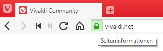
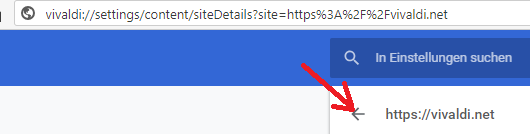
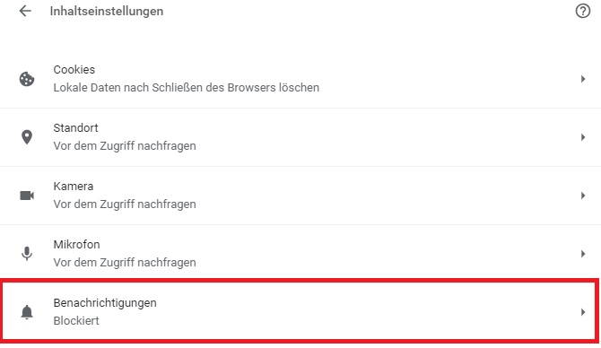

Vivaldi ist eine Software der Gattung Browser (wie "Edge", "Safari", "Chrome", etc.). Der Entwickler des Browsers Opera hat mit Vivaldi seine Idee eines flexiblen, europäischen Browsers realisiert. Der Browser wird für die Betriebssysteme "Windows" (=> Version 7), MAC-OS (=> Version 10.9) und Linux (DEB / RPM) angeboten.

## Notizen

Die offizielle ("Stable") Version wird mit einem roten Icon angezeigt. Die Snapshoot Version mit einem schwarzen Icon.  
  
  
Der Wechsel zur Snapshot Version erfolgte, nachdem die Sync Funktion getestet werden konnte. D.h. die Browserdaten (Bookmarks, Konfiguration, etc.) konnte auf verschiedenen Geräten automatisch abgeglichen werden.  Seit der Version 1.15 kann auch die "Stable" Version die Sync Funktion nutzen. Dazu muss sie in der Konfiguration aktiviert werden:  vivaldi://experiments. 
Grundsätzlich können alle Einstellungen über das kopieren des Unterverzeichnisses "User" in "Vivaldi" kopiert werden. D.h. wenn ich eine neue Instanz von Vivaldi auf einem anderen Gerät installiere, starte ich Vivaldi ein erstes Mal. Dadurch wird das Unterverzeichnis "User" erstellt. Danach überschreibe ich den Inhalt des Verzeichnisses mit meinem Orginal Verzeichnis. Die Daten können leicht über einen FAT32 formatierten USB Stick oder eine Cloudlösung (Dropbox, GDrive, etc.) vor Ort verfügbar gemacht werden.

### Praxis
[Full reset of Vivaldi](https://help.vivaldi.com/article/full-reset-of-vivaldi/)  
[Search](https://help.vivaldi.com/article/search/)  

#### Passwörter  

Passwörter können direkt in Vivaldi importiert werden: chrome://settings/passwords  
Meiner Meinung nach, sollen Passwörter nicht in einer Applikation oder Betriebssytem gespeichert werden. Eine dezentrale Lösung wie KeePass über einen USB Stick ist die bessere Lösung.  

#### AddOns  

AddOns ("Extension") sind für mich Tabu. D.h. ich vermeide Sie so gut es irgendwie möglich ist. Der Grund ist sowohl logischer als auch praktischer Natur. Praktisch sind ein Grossteil der Sicherheitsprobleme über Apps - sowohl auf Handy als auch in Browsern - entstanden.  Bzw. wurden als nicht kommunizierte Funktionen wie den Browsercache auswerten implementiert.

Analog einer Applikation die man in einem OS installiert, hat man ausfühbare Logik integriert. Quasi ein trojanisches Pferd. Es genügt, dass eine schlampige Programmierung in einschlägigen Kreisen durch sickert und schnell ist eine Routine geschrieben die den Fehler ausnutzt. Daher ergänze ich ein eingesetztes Informatiksystem nur nach reiflicher Überlegung durch Code von Dritten.  

Meine installierten AddOns:  

["Adblock for Youtube"](https://chrome.google.com/webstore/detail/adblock-for-youtube/cmedhionkhpnakcndndgjdbohmhepckk)  

["Fireshoot" - Website in Datei speichern](https://chrome.google.com/webstore/detail/take-webpage-screenshots/mcbpblocgmgfnpjjppndjkmgjaogfceg)

["Screencastify - Screen Video Recorder"](https://chrome.google.com/webstore/detail/screencastify-screen-vide/mmeijimgabbpbgpdklnllpncmdofkcpn)  

[OneNote Web Clipper](https://chrome.google.com/webstore/detail/onenote-web-clipper/gojbdfnpnhogfdgjbigejoaolejmgdhk?hl=de)

#### Push Nachrichten  

Bis jetzt in der Version 2.1 hat es keinen Menueintrag um den Browser betreffend Push Nachrichten zu konfigurieren. Man muss sich über folgenden Workaround zu den zentralen Einstellungen durchklicken:  

* Beliebige Webseite aufrufen
* Links von der URL auf das Icon    klicken und den Menupunkt "Website-Einstellungen" anklicken
* Auf den Pfeil links des Titels der Website klicken, damit man von den spezifischen Einstellungen dieser Website zu den übergeordneten allgemeinen Einstellungen ("Inhaltseinstellungen") gelangt.    

  

* Dort den Konfigurationspunkt "Benachrichtigungen" auf "Blockiert" setzen. Die Einstellung kann über den Pfeil auf der rechten Seite der Option geändert werden.  

  

## Quellen

* [Webpräsenz](https://vivaldi.com/)
* [Community](https://forum.vivaldi.net/)
* [Beta Version (Snapshot)](https://vivaldi.com/blog/snapshots/)
* [Quick Start](https://help.vivaldi.com/guide/quick-start/)
* [Vivaldi Help (en)](https://help.vivaldi.com/)
* [Vivaldi Tipps](https://vivalditips.com/)
