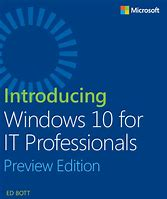
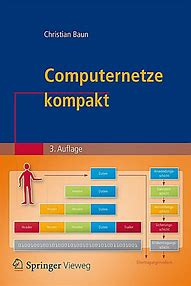

Meine Logdatei mit Notizen und Stichworten zu den gelesenen Büchern.  

# Introducing Windows 10 for IT Professionals (Preview Edition)

  

| Autor:    | Ed Bott   | 
| Verlag:   | Microsoft Press   | 
| ISBN:     |     | 

Eine von Ed Bott gewohnt gründliche Einführung. Basis des Buches war die Betaversion. Oft sind es Details wie das der Befehl „netsh“ zugunsten von Powershell cmdlets ausläuft, die man zu schätzen weiss.  

# Computernetze kompakt  

 

| Autor:    | Ed Bott   | 
| Verlag:   | Springer Verlag   | 
| ISBN:     | 978-3-662-57469-0    | 

Netzwerk	Christian Baun orientiert sich am OSI Modell und knapp und klar die wesentlichen Fakten durch.

Dank der konsequenten Ausrichtung auf dieses Modell verliert man den roten Faden nicht D.h. die Groborientierung ist gewährleistet.

# Als auf der Welt das Licht ausging  

 

| Autor:    | Tom de Marco   | 
| Verlag:   | Der Carl Hanser Verlag   | 
| ISBN:     | 978-3-446-43960-3    | 

"Der Termin" von Tom DeMarco ist wahrscheinlich der bekannteste IT und Projektmanagement Roman. Hier hat er eigentlich zwei Romane zusammen genommen. Teil 1 schildert die Entwicklung die die Wissenschaftler zwang den Stecker zu ziehen. Teil 2 ist der Aufbau der neuen Gesellschaft. Trotz Alter und amerikanischer Herkunft ist Teil  2 nichts für prüde Leser. Der 2 Teil auf mich schwelgerisch und konzeptlos gewirkt. Und der Abschluss des Buches passt exakt zu diesem Eindruck.

