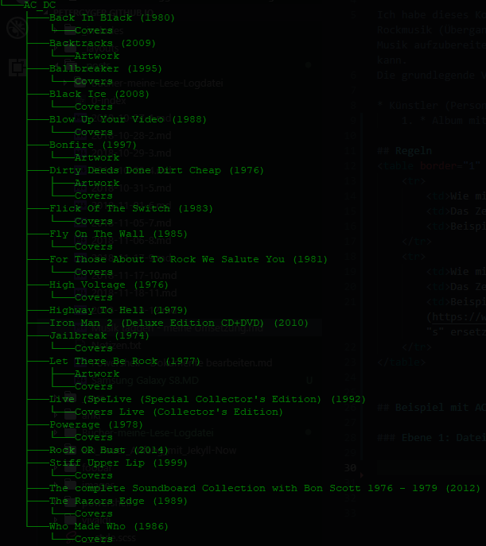

# Musik taggen - meine Umsetzung

Notizen zum taggen meiner Musik. Die Grundlage sind ID3 Tags. Mein Ziel ist es die Musik in den Applikationen "Kodi" und "Foobar2000" zu organisieren. Zur Verwaltung der Musik und Tags verwende ich die Software [MP3TAG](https://www.mp3tag.de).  

Ich habe dieses Konzept Schritt um Schritt aufgebaut, verfeinert und überarbeitet. D.h. ich habe mit Rockmusik (Übergang zu Pop fliessend) angefangen, da hier weniger Informationen als z.B. bei klassischer Musik aufzubereiten sind. Entscheidend bleibt, wie ich die Informationen in Foobar2000 und Kodi nutzen kann.  
Die grundlegende Verzeichnisstruktur sieht so aus:  

* Künstler (Person / Gruppe)
    1. * Album mit Jahreszahl. Syntax: Albumnamen, Leerschlag und Jahreszahl in runden Klammern

## Regeln
<table border="1" width="100%">
    <tr>
        <td>Wie mit nicht darstellbaren Zeichen umgehen?</td>
        <td>Das Zeichen mit einem _ (Unterstrich) ersetzen.</td>
        <td>Beispiel: AC_DC</td>
    </tr>
    <tr>
        <td>Wie mit "falschen" Zeichen umgehen</td>
        <td>Das Zeichen sinngemäss ("Best Practice") ersetzen</td>
        <td>Beispiel: Das [Eszett](https://www.duden.de/sprachwissen/rechtschreibregeln/doppel-s-und-scharfes-s) (ẞ) wird durch 2 "s" ersetzt. </td>
    </tr>
</table>

    
## Beispiel mit AC/DC  

### Ebene 1: Dateisystem

 

